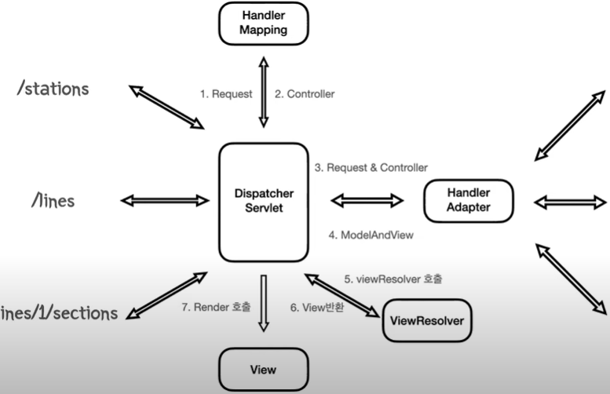

# Servlet & Spring Web MVC

## CGI (Common Gate Interface)

- 동적 데이터를 제공하기 위한 규약

### 문제점

1. 모든 사용자 요청마다 프로세스를 사용해서 리소스의 부담이 크다.

2. 같은 요청이어도 같은 cgi 구현체를 생성한다.

**이런 한계점을 극복하기 위해 나온 것이 **

## Servlet

- 각 요청에서 프로세스를 매번 생성해 요청하던 부분을 스레드로 변경하여 1번 문제점을 극복
- 싱글톤 패턴을 이용해서 2번 문제점을 극복

### 장점

- 개발자는 직접 작업할 필요없이 메소드만 재정의하고 api 요청만 하게 되면 알아서 작업을 해준다.

## Servlet Container

- Servlet의 생성,호출,제거의 모든 작업을 관리하면서 생명주기를 관리한다.

### 동작방식

1. 클라이언트의 요청이 오게 되면 Servlet Container는 요청에 맞는 Servlet을 찾게 된다.
2. 서블릿이 존재하지 않으면 새로운 서블릿을 생성하고, 이를 동작시키고, 작업이 종료된 서블릿은 다시 Servlet Container에 저장이 된다.
3. 요청과 매핑되는 서블릿이 존재하면 해당 서블릿을 다시 호출해서 작업을 수행한다.

### Servlet의 문제점

1. 서블릿은 하나의 요청마다 1대1로 매핑된다. 그렇기 때문에 중복되는 로직이 많아진다.

2. 프로그램이 서블릿에 의존적인 코드가 된다.

**이러한 문제점을 해결하기 위해서**

## Front Controller Pattern

- 클라이언트의 모든 요청을 받을 수 있는 컨트롤러를 두고, 이 곳에서 각 요청별로 처리하는 로직을 찾아 이를 전달해 요청을 수행하도록 하는 구조
- 1번, 2번 문제점 극복

## Spring Web MVC

### 이점

- 개발자들이 비즈니스 로직에 집중할 수 있도록 해준다.

