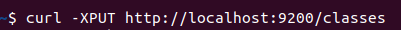
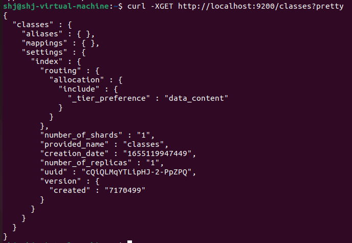
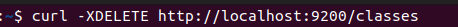
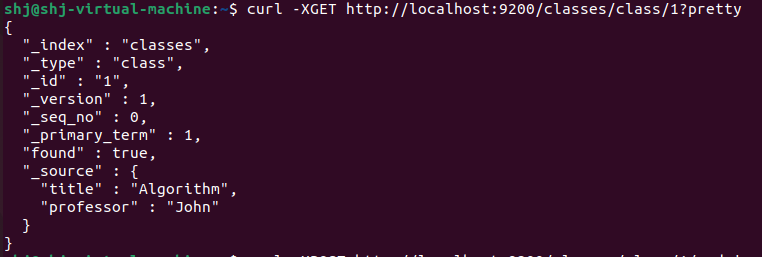
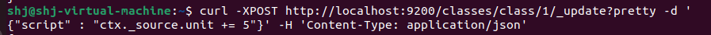
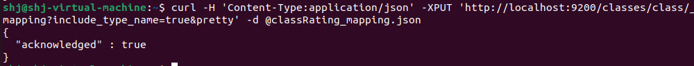

# 엘라스틱 서치

| Elastic Search | Relational DB | CRUD   |
| -------------- | ------------- | ------ |
| GET            | Select        | Read   |
| PUT            | Update        | Update |
| POST           | Insert        | Create |
| DELETE         | Delete        | Delete |

### 인덱스(classes) 생성

### 인덱스(classes) 조회

### 인덱스(classes) 삭제

### document 생성

- Document는 인덱스와 타입이 생성되어 있지 않더라도 Document를 추가하는 시점에 지정한 인덱스와 타입이 생성할 수 있습니다.

### 생성된 document 조회

### document 값 수정

> class라는 document에 있는 unit을 1로 수정한다.

> class라는 document에 있는 unit 값에 5를 더한 값으로 수정한다.

### Bulk

> bulk를 이용해서 여러 개의 document를 한꺼번에 삽입할 수 있다.

### Mapping

엘라스틱 7.x 버전부터는 curl 리퀘스트에서 헤더를 명확히 설정해주어야 하고, mapping을 생성할 때 include_type_name을 true라고 설정해주어야 한다.

이에 대한 에러 문구는 아래와 같다.

그리고 엘라스틱서치가 mapping 타입 중 string을 삭제하고 text로 변경하여 사용하고 있습니다.

관련 정보 링크 : https://stackoverflow.com/questions/47452770/no-handler-for-type-string-declared-on-field-name

