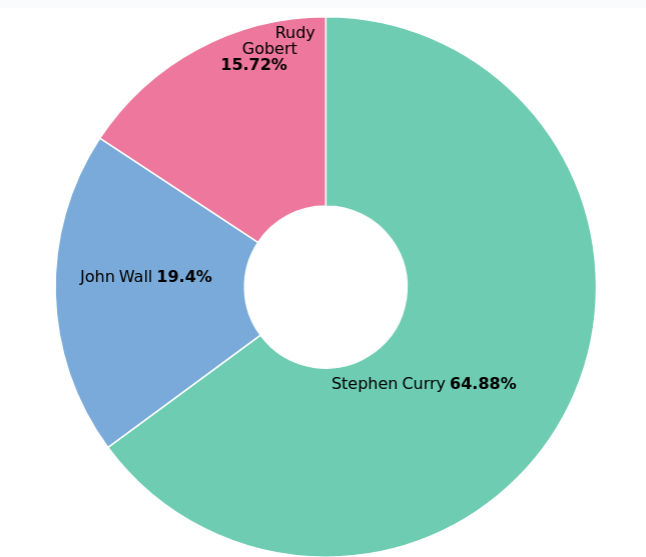

# KIBANA

### 키바나 설치 및 실행

1. 키바나 패키지 설치

   ```shell
   apt-get install kibana
   ```


2. 키바나 구성 파일을 열어서 다음 부분을 수정합니다.

   ```shell
   sudo vim /etc/kibana/kibana.yml
   
   server.host: localhost
   elasticsearch.hosts: ['http://localhost:9200']
   ```
   

3. sysctl.conf 구성파일을 편집합니다.

   ```shell
   vim /etc/sysctl.conf
   
   vm.max_map_count=262144
   fs.file-max=65536
   ```

4. sysctl.conf 파일을 읽으려면 시스템을 강제로 합니다.

   ```shell
   sysctl -p
   ```

5. 설정이 완료되었다면 키바나 서비스를 시작합니다.

   ```shell
   systemctl start kibana
   ```

6. 부팅 시간동안 키바나 서비스를 시작하도록 구성합니다.

   ```shell
   systemctl enable kibana
   ```

   

공부하다 마주친 에러 : name과 team의 string이 분리되는 문제

- text인 type을 keyword로 수정해준다.

  text 타입은 입력된 문자열을 텀 단위로 쪼개어 역 색인 구조를 만듭니다.

  fielddata : true 설정이 되면 쿼리에 메모리 사용량이 많아지기 때문에 일반적으로는 권장하지 않는다.

- keyword 타입은 입력된 문자열을 하나의 토큰으로 저장합니다. text 타입에 keyword 애널라이저를 적용한 것과 동일합니다. 집계 또는 정렬에 사용할 문자열 필드를 keyword 타입으로 지정합니다.

### 키바나 메뉴 구성

1. Management

   - index pattern : 생성한 인덱스명으로 생성이 가능하고, 생성하게 되면 매핑했던 타입과 데이터대로 키바나에서 생성해줍니다.

2. Discover

   - 특정 타임 필드나 필터를 조정할 수 있고, 조건에 맞는 데이터를 시각화해서 보여줍니다.

     New : 새로운 Discover를 만듭니다. 

     Save : 현재 설정되어있는 옵션들을 저장하여 이름을 부여할 수 있습니다. 

     Open : 기존에 저장되어 있는 Discover 화면을 불러옵니다. 

     Share : 생성한 Discover를 공유하기 위한 기능(csv, iframe, link 등)

     Inspect : Discover 페이지에 대한 요약정보와 요청정보, 수신정보 등을 확인할 수 있는 기능

   - 필터 기능

     검색어와 기본 범위를 지정할 수 있습니다.

3. Visualize

   - Bar chart, Pie chart, map 등 여러가지 시각화 차트가 존재하고, 필터들을 조정해서 시각화를 할 수 있습니다.

   

   ​                                                                                                       pie chart

   

   

   

​                                                                                                       vertical bar chart

4. Dashboard

   - Visualize에서 시각화한 것들을 save한 후 Dashboard에 넣을 수 있습니다.

     


