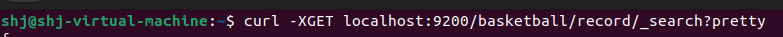

# 엘라스틱 서치

| Elastic Search | Relational DB | CRUD   |
| -------------- | ------------- | ------ |
| GET            | Select        | Read   |
| PUT            | Update        | Update |
| POST           | Insert        | Create |
| DELETE         | Delete        | Delete |

### 인덱스(classes) 생성


### 인덱스(classes) 조회


### 인덱스(classes) 삭제


### document 생성


- Document는 인덱스와 타입이 생성되어 있지 않더라도 Document를 추가하는 시점에 지정한 인덱스와 타입이 생성할 수 있습니다.

### 생성된 document 조회


### document 값 수


> class라는 document에 있는 unit을 1로 수정한다.


> class라는 document에 있는 unit 값에 5를 더한 값으로 수정한다.

### Bulk


> bulk를 이용해서 여러 개의 document를 한꺼번에 삽입할 수 있다.

### Mapping


엘라스틱 7.x 버전부터는 curl 리퀘스트에서 헤더를 명확히 설정해주어야 하고, mapping을 생성할 때 include_type_name을 true라고 설정해주어야 한다.ㅔㄱㄷ

이에 대한 에러 문구는 아래와 같다.


그리고 엘라스틱서치가 mapping 타입 중 string을 삭제하고 text로 변경하여 사용하고 있습니다.

관련 정보 링크 : https://stackoverflow.com/questions/47452770/no-handler-for-type-string-declared-on-field-name

### 조회(Search)



> curl -XGET 엘라스틱 주소/인덱스/타입/_search?(pretty : 이쁘게 출력)

#### 특정 조건에 맞는 값만 조회


> curl -XGET 엘라스틱 주소/인덱스/타입/_search?q=쿼리문&(pretty : 이쁘게 출력)

#### Request Body를 사용해 조회


### Metric Aggregation

- elastic search안에 있는 document안에서 조합을 통해서 특정 값들을 구해낼 때 사용 그 중 metric은 연산을 할 대 사용한다.

1. 최대값


- 실행 결과


2. 최소값


- 실행 결과


3. 평균값


- 실행 결과


#### 모든 값들을 한번에 도출


- 실행 결과


### Bucket Aggregation

- Group By라고 생각하면 된다.

terms_aggs.json

```json
{
        "size" : 0,
        "aggs" : {
                "players" : {
                        "terms" : {
                                "field" : "team"
                        }
                }
        }
}
```

1. 'size : 0' => 우리가 원하는 정보만 보기 위해서

2. 'terms' => 사용할 aggregation
3. 'field' : 'team' => team별로 group by


- 실행 결과

  

  

stats_by_team.json

```json
  {
          "size" : 0,
          "aggs" : {
                  "team_stats" : {
                          "terms" : {
                                  "field" : "team"
                          },
                          "aggs" : {
                                  "stats_score" : {
                                          "stats" : {
                                                  "field" : "points"
                                          }
                                  }
                          }
                  }
          }
  }
```

1. team 별로 document를 묶어준다.
2. 그 결과값에 대해서 다시 aggregation을 넣어준다. 
3. 점수별로 stats를 표시해준다.


- 실행 결과

  

