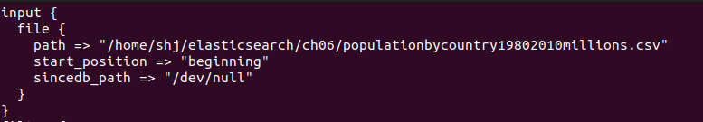
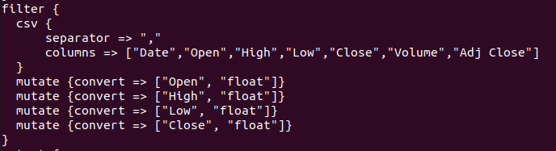

# LOGSTASH 설치 및 실행

1. 자바가 깔려있어야 하기 때문에 java-version을 통해 자바 설치 유무 확인

2. 자바가 설치되어 있다면 www.elastic.co/downloads/logstash에서 최신버전의 logstash 다운

3. sudo dpkg -i (logstash_name)를 통해 설치

4. config Logstash

   

   path : 데이터의 절대경로

   start_position : 기본값("end"), 처음부터 읽기 위해선 beginning

   sincedb_path : /dev/null을 입력해야 logstash로 데이터를 넣을 때마다 데이터가 들어가게 됩니다. 

   

   mutate : csv 파일은 모두 텍스트로 되어있기 때문에 각 값들의 타입을 알맞게 바꿔준다.
