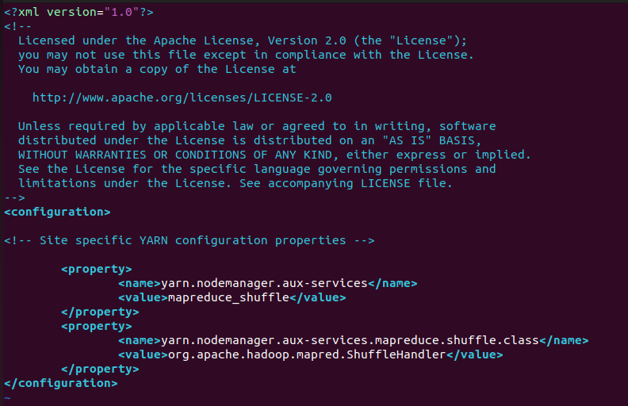
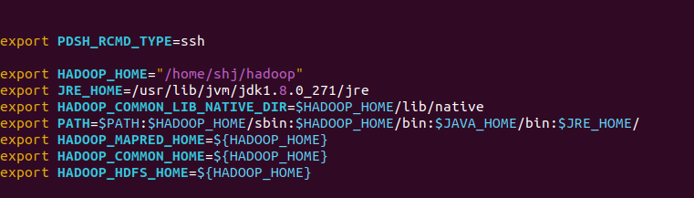
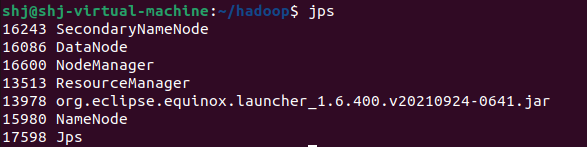
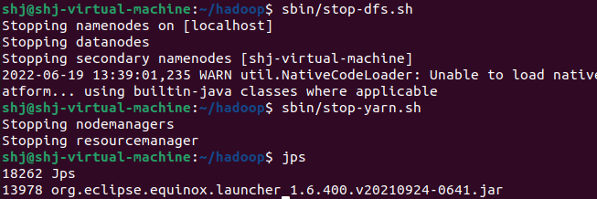

# 하둡 설치 및 실행

1. ssh 설치

   ```shell
   sudo apt-get install ssh
   sudo apt-get install pdsh
   ```

2. 권한 변경

   ```shell
   sudo chmod -R 777 ~/shj/.bashrc # 읽기,쓰기가 가능하도록 권한 변경
   ssh-keygen -t rsa -P "" # rsa 비대칭키 생성 private key는 ~/.ssh/id_rsa에 public key는 ~/.ssh/id_rsa.pub로 생성됩니다.
   cat ~/.ssh/id_rsa.pub >> ~/.ssh/authorized_keys
   ssh localhost
   exit
   sudo apt-get update
   ```

3. 자바 설치
 ```shell
 오라클에서 java 1.8 linux version download
 적당한 곳에 압축파일 해제
 sudo tar -xzvf [다운 받은 파일 경로]
 + 환경 변수 설정
 ```

​	3-1. root 계정에 설정하는 방법

​	 root 계정에 환경변수를 등록하려면 /etc/profile에 추가하면 됩니다.

 ```shell
 $ vim /etc/profile
 ```

 	위의 명령어로 profile 파일을 연 뒤, 아래의 내용을 추가한다. 보통 맨 아래에 입력합니다.

 ```shell
 export JAVA_HOME=/usr/bin/jvm/[설치한 자바 버전] #본인의 자바 설치 경로
 export PATH=$JAVA_HOME/bin:$PATH
 export  CLASSPATH=$CLASSPATH:$JAVA_HOME/jre/lib/ext:$JAVA_HOME/lib/tools.jar
 ```

 	새로 설정한 환경 변수 설정을 적용하기 위해 source 명령어로 적용시킵니다.

 ```shell
 $ source /etc/profile
 ```

​	 3-2. 특정 계정에 설정하는 방법 (~/.bashrc)

 	특정 계정에 환경변수를 등록하려면 ~/.bashrc 파일에 추가하면 됩니다.

 ```shell
 $ vim /home/shj/.bashrc
 ```

 	위의 명령어로 bashrc파일을 연 뒤,  위처럼 아래의 내용을 추가해줍니다.

 ```shell
 export JAVA_HOME=/usr/lib/jvm/[설치한 자바 버전] #본인의 자바 설치 경로
 export PATH=${PATH}:${JAVA_HOME}/bin
 ```

 	마찬가지로 source 명령어로 새로 설정한 환경 변수를 적용시켜줍니다.

 ```shell
 $ source /etc/profile
 ```

3-3. 환경 변수 확인

환경 변수가 잘 적용되었는 지 확인합니다

```shell
$ echo $JAVA_HOME
>> usr/lib/jvm/[설치한 자바 버전]
```

4. 하둡 다운로드 -> 압축 해제

   ```shell
   wget https://downloads.apache.org/hadoop/common/[설치하고자 하는 하둡 버전]/[설치하고자 하는 하둡 버전].tar.gz
   ```

5. 하둡 설정 파일 변경

   1) JAVA_HOME 설정

      nano ~/hadoop/etc/hadoop/hadoop-env.sh
      ```shell
      export JAVA_HOME=/usr/lib/jvm/[java_version]
      ```

   2. Hadoop Configuration file 설정
   
      core-site.xml / hdfs-site.xml / mapred-site.xml / yarn.xml
   
      core-site.xml 설정 : 하둡 실행 초기화면
   
      
   
      hdfs-site.xml 설정 : namenode, datanode 디렉토리 생성
   
      ```shell
      $mkdir -p ~/shj/hadoop/hdfs/namenode
      $mkdir -p ~/shj/hadoop/hdfs/datanode
      ```
   
      
   
      mapred-site.xml 설정
   
      
   
      yarn-site.xml
   
      
   
6. hadoop 환경변수 설정(/home/shj/.bashrc 파일)

   

   hdfs namenode를 포맷한다.

   ```shell
   /bin/hdfs namenode -format
   ```

7. DFS 데몬 실행/중지 및 hadoop에 작동중인 프로세스 확인

   ```shell
   :~/hadoop$ sbin/start-dfs.sh
   $jps
   :~/hadoop$ start-yarn.sh
   $jps
   ```

   - 실행 결과

     

   ```shell
   :~/hadoop$ sbin/stop-dfs.sh
   $jps
   :~/hadoop$ stop-yarn.sh
   $jps
   ```

   
