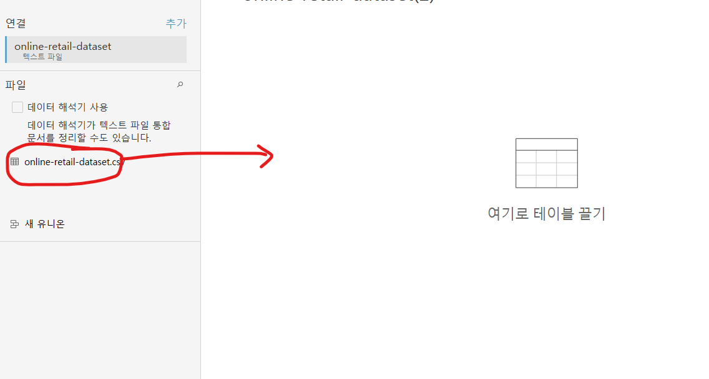
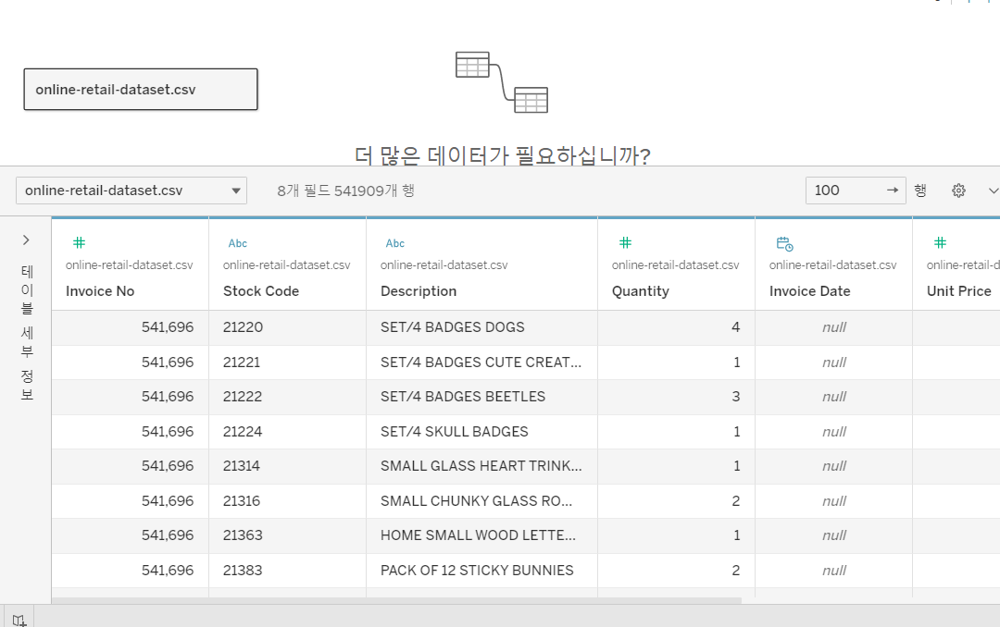
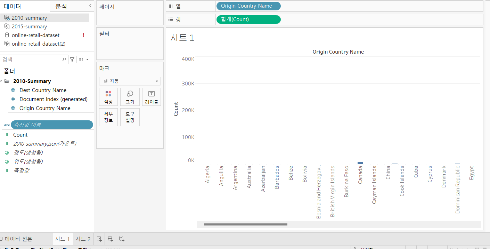

# 태블로 베이직 (Tableau Desktop)

## 1. 데이터 연결하기

### 1. 파일에 연결

- 로컬 환경에서 엑셀, 텍스트, json, pdf 등 여러 형식의 파일들을 불러올 수 있다.

### 2. 서버에 연결

- 다양한 서버(Google Big Query, Google Drive, Drop box, 데이터베이스 등)에 있는 데이터를 태블로에 불러올 수 있다.

### 3. 저장된 데이터 원본

- 태블로에서 기본적으로 제공하는 샘플 데이터

## 2. 데이터 준비하기

1. 작업할 데이터를 불러온 뒤, drag & drop으로 테이블을 끌어 오면 된다.

2. 태블로는 이종 DB간의 데이터 조인이 가능하다.

### 라이브  VS  추출

|      | 라이브                             | 추출                                              |
| ---- | ---------------------------------- | ------------------------------------------------- |
| 장점 | 신속한 업데이트                    | 빠른 처리 속도, 모든 종류의 태블로 기능 사용 가능 |
| 단점 | DB 부하, 상대적으로 늦은 처리 속도 | 상대적으로 느린 업데이트 주기                     |

만드려고 하려는 화면의 목적과 사용하고 있는 DB 종류에 따라 알맞은 방식을 선택해 줍니다.

### 데이터 원본 필터

전체 데이터 중 일부 데이터로 작업하고자 할 때, 필터를 통해서 작업하고자 하는 데이터만 따로 불러와 화면의 부하를 줄일 수 있습니다.

## 3. 데이터 작업하기

- 테이블에 있는 모든 필드들을 차원과 측정값으로 나눕니다.
- 초록색 : 연속형, 푸른색 : 불연속형
- sheet : 하나의 워크 스페이스
- 대시보드 : 여러 개의 sheet를 이용해서 하나의 대시보드를 만들 수 있다.
- 행과 열 바꾸기(ctrl+w) : 말 그대로 행에 있는 내용과 열에 있는 내용을 뒤바꾸는 기능
- 레이블 붙이기 : 카테코리 별 값이 화면에 표시된다.
- 프리젠테이션 모드
- 표현 방식 : 특정 차트를 그리기 위해 필요한 조건들이 명시되어 있고, 조건을 만족하는 경우 해당 차트를 그릴 수 있도록 활성화 된다.

