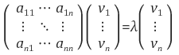

### [선형대수학] 고유값과 고유벡터 (eigenvalue & eigenvector)

1. 고유값, 고유벡터란?

   행렬 A를 선형변환으로 봤을 때, 선형변환 A에 의한 변환결과가 자기 자신의 상수배가 되는 0이 아닌 벡터를 고유벡터(eigenVector)라고 하고, 이 상수배 값을 고유값(eigenValue)이라 한다.

   N*N 정방행렬 A에 대해 A**v** = λ**v**를 만족하는 0이 아닌 열벡터 **v**를 고유벡터, 상수 λ를 고유값이라 정의한다.

   

   

   즉, 고유값과 고유벡터는 행렬에 따라 정의되는 값으로 어떤 행렬은 이러한 고유값-고유벡터가 아예 존재하지 않을 수도 있고, 어떤 행렬은 하나만 존재하거나 최대 N개까지 존재할 수 있다.

   

2. 기하학적 의미

   기하학적으로는 행렬 A의 고유벡터는 선형변환 A에 의해 방향은 보존되고 스케일만 변화되는 방향 벡터를 나타내고, 고유값은 그 고유벡터의 변화되는 스케일 정도를 나타내는 값이다.

   

3. 고유값 분해를 이용한 대각화 - Eigendecomposition

   고유값, 고유벡터는 정방행렬의 대각화와 밀접한 관련이 있다. (Eigendecomposition은 정방행렬에 대해서만 가능함.)

   먼저 대각행렬과의 행렬곱에 대해 살펴보면, 대각행렬을 뒤에 곱하면 행렬의 열벡터들이 대각원소의 크기만큼 상수배가 된다.

   

   행렬 A의 고유값, 고유벡터들을 λi, **v**i, i = 1, 2, ..., n이라 하자.

   

   

   이제 위 식을 표현하여 정리하면

   

   가 성립합을 알 수 있다.

   즉 행렬 A의 고유벡터들을 열벡터로 하는 행렬을 P, 고유값들을 대각원소로 하는 대각행렬을 Λ라하면, 다음 식이 성립한다.

   

   

   이와 같이 행렬 A는 자신의 고유벡터들을 열벡터로 하는 행렬과 고유값을 대각원솔 하는 행렬 곱으로 대각화 분해가 가능한데, 이러한 대각화 분해를 eigendecomposition이라 한다.

   행렬 A의 eigendecomposition을 알면 행렬식 값 det(A), A의 거듭제곱, 역행렬, 대각합, 행렬의 다항식 등을 