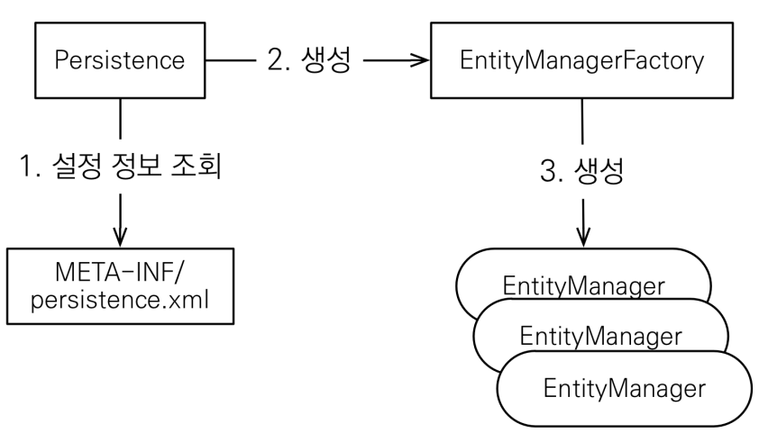

# JPA 시작

## JPA 구동 방식

## 회원 저장

### 주의

- 엔티티 매니저 팩토리는 하나만 생성해서 애플리케이션 전체에서 공유한다.
- 엔티티 매니저는 스레드간에 공유 하지 않는다.
- JPA의 모든 데이터 변경은 트랜잭션 안에서 실행되어야 한다.

## JPQL

- JPA는 SQL을 추상화한 JPQL이라는 객체 지향 쿼리 언어를 제공한다
- SQL 문법과 유사하고, select, from, where, group by, having, join을 지원한다
- JPQL은 엔티티 객체를 대상으로 쿼리한다.
- SQL은 데이터베이스 테이블을 대상으로 쿼리한다.
- SQL을 추상화해서 특정 데이터베이스 SQL에 의존하지 않는다.

