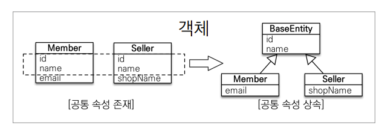

# 고급 매핑

## 상속 관계 매핑

- 관계형 데이터베이스는 상속 관계가 없다
- 슈퍼타입 서브타입 관계라는 모델링 기법이 객체 상속 관계와 유사함.
- 객체의 상속과 구조와 DB의 슈퍼타입 서브타입 관계를 매핑

## 주요 어노테이션

- @Inheritance(strategy = InheritanceType.XXX)
  - joined : 조인 전략
  - single_table : 단일 테이블 전략
  - table_per_class : 구현 클래스마다 테이블 전략
- @DiscriminatorColumn(name="DTYPE")
- @DiscriminatorValue("XXX")

## 조인 전략

- 장점
  - 테이블 정규화
  - 외래 키 참조 무결성 제약 조건 활용 가능
  - 저장 곤간 효율화
- 단점
  - 조회시 조인을 많이 사용, 성능 저하
  - 조회 쿼리가 복잡함.
  - 데이터 저장시 insert 쿼리가 2번 호출

## 단일 테이블 전략

-  장점

  - 조인이 필요없으므로 조회 성능이 빠름.
  - 조회 쿼리가 단순함

- 단점

  - 자식 엔티티가 매핑한 컬럼은 모두 null 허용

  - 단일 테이블에 모든 것을 저장하기 때문에 테이블이 커질 수 있다. 상황에 따라서 조회 성능이 오히려 느려질 수 있다.

    

## 구현 클래스마다 테이블 전략 (추천하지 않음)

- 장점
  - 서브 타입을 명확하게 구분해서 처리할 때 효과적
  - not null 제약조건 사용 가능
- 단점
  - 여러 자식 테이블을 함께 조회할 때 성능이 나쁨. (union sql 필요)
  - 자식 테이블을 통합해서 쿼리하기 어려움.

## @MappedSuperclass

- 공통 매핑 정보가 필요할 때 사용(id, name)

  

- 상속 관계 매핑이 아님
- 엔티티도 아니고, 테이블과 매핑되지 않음
- 부모 클래스를 상속 받는 자식 클래스에 매핑 정보만 제공함
- 조회, 검색 불가
- 직접 생성해서 사용할 일이 없기 때문에 추상 클래스 권장

