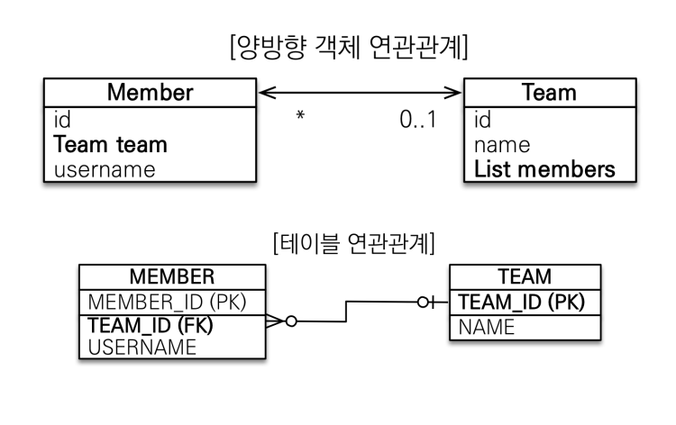

# 연관관계 매핑

## 목표

- 객체와 테이블 연관관계의 차이를 이해할 수 있다.
- 객체의 참조와 테이블의 외래 키를 매핑할 수 있다.

### 객체를 테이블에 맞추어 데이터 중심으로 모델링하면, 협력 관계를 만들지 못한다.

- 테이블은 외래 키 조인을 사용해서 연관된 테이블을 찾는다.

- 객체는 참조를 사용해서 연관된 객체를 찾는다.

  

## 1. 단방향 연관관계

## 2. 양방향 연관관계와 연관관계의 주인 (중요)

### 연관관계의 주인과 mappedBy

### 객체와 테이블이 관계를 맺는 차이

- 객체 연관관계 = 2개
  - 회원 -> 팀, 팀 -> 회원
- 테이블 연관관계 = 1개
  - 회원 <-> 팀의 연관관계

### 테이블의 양방향 연관관계

- 테이블은 외래 키 하나로 두 테이블의 연관관계를 관리한다.
- MEMBER.TEAM_ID 외래 키 하나로 양쪽으로 조인이 가능하다.

### 둘 중 하나로 외래 키를 관리해야 한다.

- Member의 team으로 관리해야 할 지, Team의  members로 관리해야 할 지 정해야 한다.

### 연관관계의 주인

 **양방향 매핑 규칙**

- 객체의 두 관계 중 하나를 연관관계의 주인으로 지정
- 연관관계의 주인만 외래 키를 관리(등록, 수정)
- 주인이 아닌 쪽은 읽기만 가능
- 주인이 아닌 쪽은 mappedBy 속성으로 주인을 지정한다.

### 누구를 주인으로?

- 외래 키가 있는 곳을 주인으로 정해라

### 양방향 매핑 시 가장 많이 하는 실수

연관관계의 주인에 값을 입력하지 않음.

- 양방향 매핑을 할 때는 연관관계의 주인에 값을 입력해야 한다.

### 양방향 연관관계 때 주의할 점

- 순수 객체 상태를 고려해서 항상 양쪽에 값을 설정하자.
- 연관관계 편의 메소드를 생성하자.
- 양방향 매핑시에 무한 루프를 조심하자.
  - 예 : toString(), lombok, Json 생성 라이브러리

### 양방향 매핑 정리

- 단방향 매핑만으로도 이미 연관관계 매핑은 완료
- 단방향 매핑을 잘 하고, 양방향은 필요할 때만 추가해도 된다.

## 다양한 연관관계 매핑

## 1. 다대일 [N : 1]

- 외래키가 있는 쪽이 연관관계의 주인
- 양쪽을 서로 참조하도록 개발

## 2. 일대다 [1 : N]

- 일대다 단방향은 일대다에서 1이 연관관계의 주인
- 테이블 일대다 관계는 항상 다 쪽에 외래 키가 있음.
- 객체와 테이블의 차이 때문에 반대편 테이블의 외래 키를 관리하는 특이한 구조
- @JoinColumn을 꼭 사용해야 함. 그렇지 않으면 조인 테이블 방식을 사용함. (중간에 테이블 하나를 추가함.)

### 일대다 단방향 매핑의 단점

- 일대다 단방향 매핑의 단점
  - 엔티티가 관리하는 외래 키가 다른 테이블에 있음
  - 연관관계 관리를 위해 추가로 UPDATE SQL 실행
- 일대다 단방향 매핑보다는 다대일 양방향 매핑을 사용하자

### 일대다 양방향 정리

- 공식적으로 존재하지는 않음
- @JoinColumn(insertable = false, updatable = false)
- 읽기 전용 필드를 사용해서 양방향처럼 사용하는 방법
- 다대일 양방향을 사용하자

## 3. 일대일 [1 : 1]

- 주 테이블이나 대상 테이블 중에 외래 키 선택 가능
- 외래 키에 데이터베이스 유니크 제약조건 추가

### 3-1. 주 테이블에 외래 키 단방향

- 주 테이블에 외래 키 단방향 정리
  - 다대일 단뱡향 매핑과 유사함.

### 3-2. 대상 테이블에 외래 키 단방향

- 다대일 양방향 매핑처럼 외래 키가 있는 곳이 연관관계의 주인
- 반대편은 mappedBy 적용

### 정리

- 주 테이블에 외래 키
  - 주 객체가 대상 객체의 참조를 가지는 것처럼 주 테이블에 외래 키를 두고 대상 테이블을 찾음
  - 객체지향 개발자 선호
  - JPA 매핑이 편리
  - 장점 : 주 테이블만 조회해도 대상 테이블에 데이터가 있는 지 확인 가능
  - 단점 : 값이 없으면 외래 키에 null 허용
- 대상 테이블에 외래 키
  - 대상 테이블에 외래 키가 존재
  - 데이터베이스 개발자 선호
  - 장점 : 주 테이블과 대상 테이블을 일대일에서 일대다 관계로 변경할 때 테이블 구조를 유지
  - 단점 : 프록시 기능의 한계로 지연 로딩으로 설정해도 항상 즉시 로딩됨.

## 4. 다대다 [N:M]

- 관계형 데이터베이스는 정규화된 테이블 2개로 다대다를 표현할 수 없음
- 연결 테이블을 추가해서 일대다, 다대일 관계로 풀어낸다.

- 객체는 컬렉션을 사용해서 객체 2개로 다대다 관계가 가능함.
- @ManyToMany 사용
- @JoinTable로 연결 테이블 지정

### 다대다 매핑의 한계

- 편리해보이지만 실무에서 사용하지 않음
- 주문시간, 수량 같은 데이터가 들어올 수 있음.

### 다대다 한계 극복

- 연결 테이블용  엔티티 추가
- @ManyToMany -> @OneToMany, @ManyToOne

