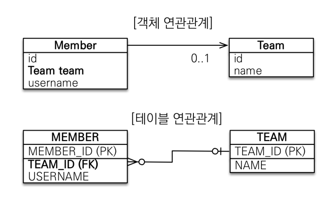
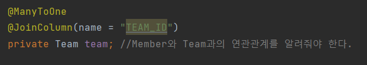
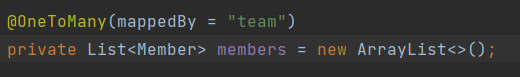
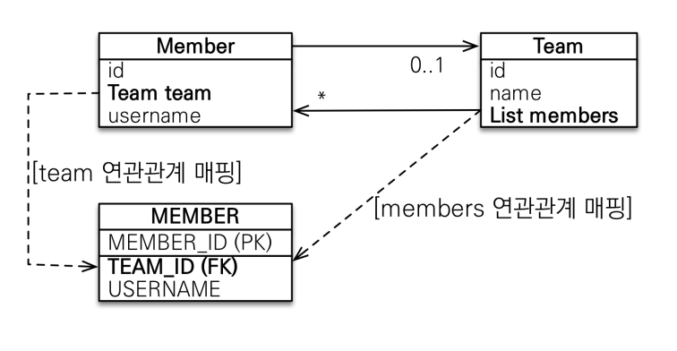
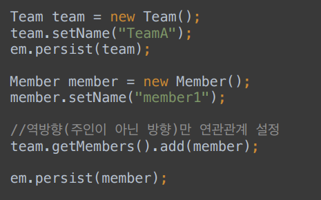
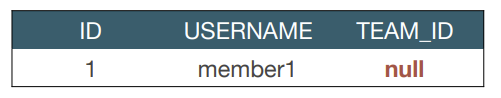

# 연관관계 매핑

## 목표

- 객체와 테이블 연관관계의 차이를 이해할 수 있다.
- 객체의 참조와 테이블의 외래 키를 매핑할 수 있다.

### 객체를 테이블에 맞추어 데이터 중심으로 모델링하면, 협력 관계를 만들지 못한다.

- 테이블은 외래 키 조인을 사용해서 연관된 테이블을 찾는다.

- 객체는 참조를 사용해서 연관된 객체를 찾는다.

  

## 1. 단방향 연관관계

## 2. 양방향 연관관계와 연관관계의 주인 (중요)

### 연관관계의 주인과 mappedBy

### 객체와 테이블이 관계를 맺는 차이

- 객체 연관관계 = 2개
  - 회원 -> 팀, 팀 -> 회원
- 테이블 연관관계 = 1개
  - 회원 <-> 팀의 연관관계

### 테이블의 양방향 연관관계

- 테이블은 외래 키 하나로 두 테이블의 연관관계를 관리한다.
- MEMBER.TEAM_ID 외래 키 하나로 양쪽으로 조인이 가능하다.

### 둘 중 하나로 외래 키를 관리해야 한다.

- Member의 team으로 관리해야 할 지, Team의  members로 관리해야 할 지 정해야 한다.

### 연관관계의 주인

 **양방향 매핑 규칙**

- 객체의 두 관계 중 하나를 연관관계의 주인으로 지정
- 연관관계의 주인만 외래 키를 관리(등록, 수정)
- 주인이 아닌 쪽은 읽기만 가능
- 주인이 아닌 쪽은 mappedBy 속성으로 주인을 지정한다.

### 누구를 주인으로?

- 외래 키가 있는 곳을 주인으로 정해라

### 양방향 매핑 시 가장 많이 하는 실수

연관관계의 주인에 값을 입력하지 않음.

- 양방향 매핑을 할 때는 연관관계의 주인에 값을 입력해야 한다.

### 양방향 연관관계 때 주의할 점

- 순수 객체 상태를 고려해서 항상 양쪽에 값을 설정하자.
- 연관관계 편의 메소드를 생성하자.
- 양방향 매핑시에 무한 루프를 조심하자.
  - 예 : toString(), lombok, Json 생성 라이브러리

### 양방향 매핑 정리

- 단방향 매핑만으로도 이미 연관관계 매핑은 완료
- 단방향 매핑을 잘 하고, 양방향은 필요할 때만 추가해도 된다.