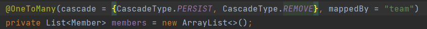
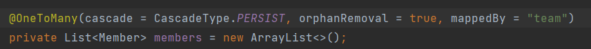
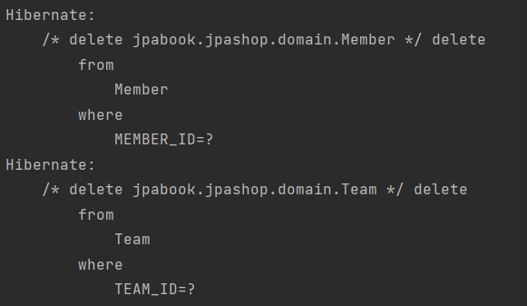
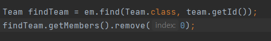
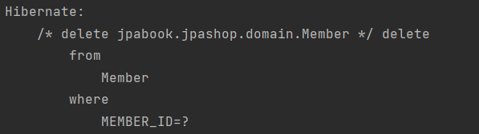

# 영속성 전이 : cascade

- 엔티티를 영속화할 때 연관된 엔티티도 함께 영속화 해준다.

- 연관관계를 잘 고려해서 설정해야 한다.

## 고아 객체

- 참조하는 곳이 하나일 때 사용해야 함.

- @OneToOne, @OneToMany만 가능

## 영속성 전이 + 고아 객체, 생명 주기

- CascadeType.ALL + orphanRemoval = true
- 두 옵션을 모두 활성화하면 부모 엔티티를 통해서 자식의 생명주기를 관리할 수 있다.

- 도메인 주도 설계의 Aggregate Root 개념을 구현할 때 유용함.

## 의문점

## Cascade.REMOVE vs orphanRemoval = true

- Cascade.REMOVE

  

- orphanRemoval = true

  

### 1. 부모 엔티티 제거

- 두 코드 모두 부모와 연관된 엔티티까지 같이 DB에서 삭제됩니다.

​                                                                                                결과(두 코드 동일한 결과)

### 2. 부모 엔티티 컬렉션에서 자식 엔티티 제거

- cascade.REMOVE의 경우 부모와 연결이 끊어졌다해도 자식 엔티티는 그대로 남아 있다.
  - delete 쿼리문이 실행되지 않음.

- 하지만 orphanRemoval = true의 경우에는 부모와 연결이 끊어진 자식 엔티티의 경우 DB에서 삭제되었다.

  

