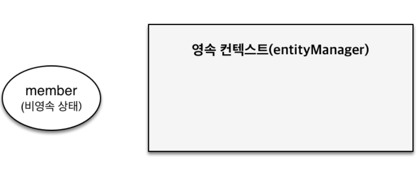
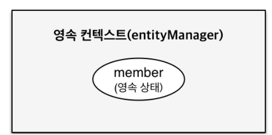
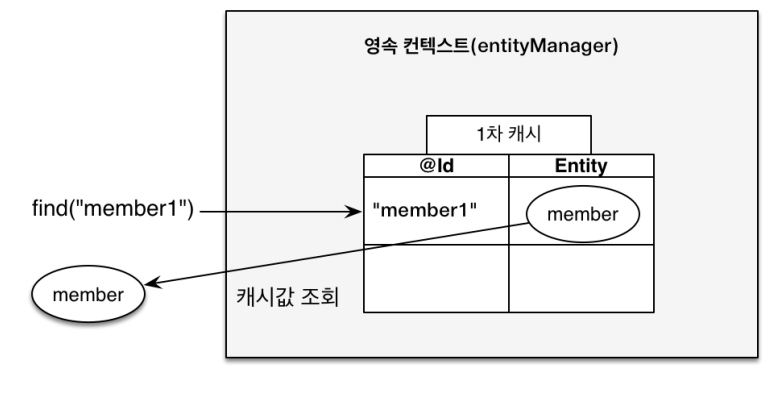
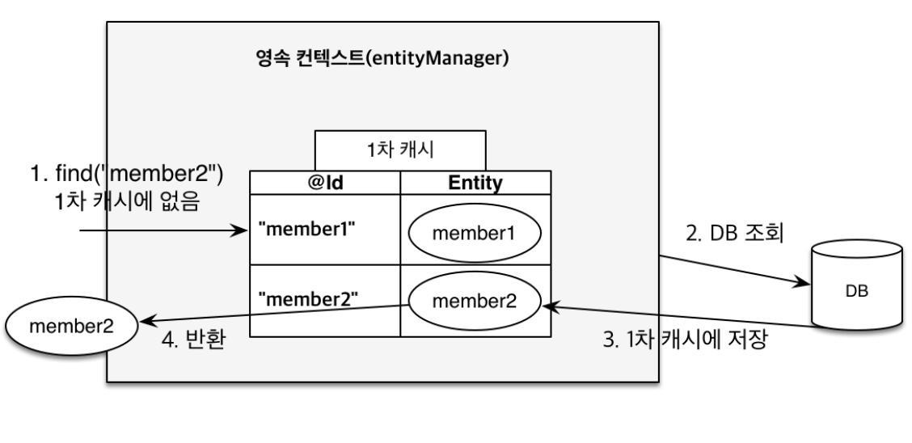
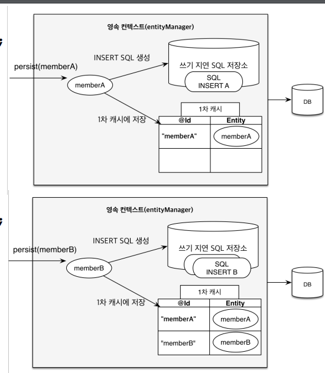
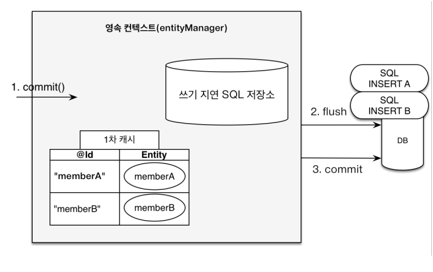
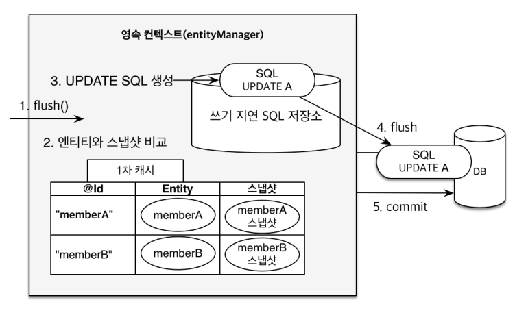

# 영속성 관리

## 영속성 컨텍스트

- JPA를 이해하는 데 가장 중요한 용어
- 엔티티를 영구 저장하는 환경이라는 뜻
- EntityManager.persist(entity);
- 영속성 컨텍스트는 논리적인 개념

## 엔티티의 생명주기

- 비영속 (new/transient)

  영속성 컨텍스트와 전혀 관계가 없는 새로운 상태

- 영속 (managed)

  영속성 컨텍스트가 관리되는 상태

- 준영속 (detached)

  영속성 컨텏트에 저장되었다가 분리된 상태

- 삭제 (removed)

  삭제된 상태

### 1. 비영속



```java
//객체를 생성하기만 한 상태
Member member = new Member();
member.setId("member1");
member.setUsername("회원1");
```

### 2. 영속



```java
Member member = new Member();
member.setId("member1");
member.setUsername(“회원1”);

EntityManager em = emf.createEntityManager();
em.getTransaction().begin();

// 객체를 저장한 상태(영속)
em.persist(member);
```


### 3. 준영속, 삭제

```java
// 회원 엔티티를 영솏 컨텍스트에서 분리, 준영속 상태
em.detach(member);

//객체를 삭제한 상태
em.remove(member);
```


## 영속성 컨텍스트의 이점

- 1차 캐시

```java
Member member = new Member();
member.setId("member1");
member.setUsername("회원1");
//1차 캐시에 저장됨
em.persist(member);
//DB보다 먼저 1차 캐시에서 조회한다.
Member findMember = em.find(Member.class, "member1");
```



```java
Member findMember2 = em.find(Member.class, "member2");
```



1차 캐시에서 우선 조회하고 없으면 db에서 조회 후 1차 캐시에 저장합니다.

- 동일성 보장

  ```java
  Member a = em.find(Member.class, "member1");
  Member b = em.find(Member.class, "member1");
  System.out.println(a == b); //동일성 비교 true
  ```

  

- 트랜잭션을 지원하는 쓰기 지연

  ```java
  EntityManager em = emf.createEntityManager();
  EntityTransaction tx = em.getTransaction();
  //엔티티 매니저는 데이터 변경시 트랜잭션을 시작해야 한다.
  tx.begin();
  
  em.persist(member1);
  em.persist(member2);
  
  // 커밋하는 순간 데이터베이스에 insert 쿼리를 보낸다.
  tx.commit();
  ```

  ​                                                                                                     **em.persist()**

  

  - em.persist()로 엔티티를 저장하게 되면 1차캐시에 저장됨과 동시에 쓰기 지연 SQL 저장소에 쿼리문이 저장된다.

  ​                                                                                    **transaction.commit()**

  

  - 트랜잭션이 커밋이 되면 쓰기 지연 SQL 저장소에 저장되어 있던 쿼리문들이 flush 되면서 db에 날아간다.

- 변경 감지(Dirty Checking)

  ```java
  EntityManager em = emf.createEntityManager();
  EntityTransaction transaction = em.getTransaction();
  
  transaction.begin();
  
  // 영속 엔티티 조회
  Member memberA = em.find(Member.class, "memberA");
  
  // 영속 엔티티 데이터 수정
  memberA.setUsername("newMember");
  memberA.setAge(10);
  
  tx.commit();
  ```

  

- 지연 로딩(Lazy Loading)

