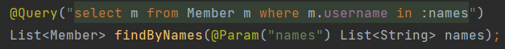
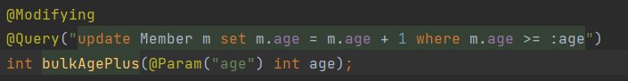

# JPA NamedQuery(실무에선 잘 안씀)

## NameQuery 정의


## JPA를 직접 사용해서 NamedQuery 사용


## 스프링 데이터 JPA로 NamedQuery 사용

 

- @Query를 생략해도 우선적으로 Member.findByUsername이란 이름의 Named 쿼리를 찾아서 실행시켜준다. 없다면 메소드명으로 쿼리를 실행해준다.


## NamedQuery의 장점

- NamedQuery는 애플리케이션 로딩 시점에서 오류를 잡아준다.

  


## 리포지토리 메소드에 쿼리 정의하기


- 실무에서 가장 많이 씀 (개인적)
- NamedQuery와 마찬가지로 애플리케이션 로딩 시점에 오류를 잡아준다.


## 파라미터 바인딩

```java
select m from Member m where m.username = ?0 // 위치 기반
select m from Member m where m.username = :name // 이름 기반
```

**컬렉션 파라미터 바인딩**



[실행 결과]


# 스프링 데이터 JPA 페이징과 정렬


**테스트 코드**


**[실행 결과]**


- 이 때 Slice로 할 경우 count 쿼리는 나가지 않는다.

- 위 코드는 limit을 3으로 설정했는 데 slice의 경우는 3+1인 4로 쿼리가 나간다.

  - Page로 쿼리를 날릴 때

  

  - Slice로 쿼리를 날릴 때

  


**count 쿼리를 분리할 수 있다.**


## 실무 꿀팁

- api에 엔티티를 직접 반환하지 않고 DTO로 변환한 후 반환해야 한다.


# 벌크성 수정 쿼리



**주의할 점**

- 벌크 연산은 영속성 컨텍스트를 무시하고 DB에 바로 쿼리를 날리기 때문에 DB와 영속성 컨텍스트의 값이 다를 수 있다.
- 그렇기 때문에 벌크 연산을 수행한 후에는 em.clear()로 영속성 컨텍스트를 날려서 DB에서 가져오게 한다.
- 혹은 @Modifying에 clearAutomatically = true로 설정해주면 된다.


# Entity Graph

- 지연로딩에서 발생하는 N+1 문제를 해결해주는 기능
- 페치 조인과 기능이 동일함

1. @NamedEntityGraph

   

   

2. @EntityGraph

   

[실행 결과]


# JPA Hint & Lock

