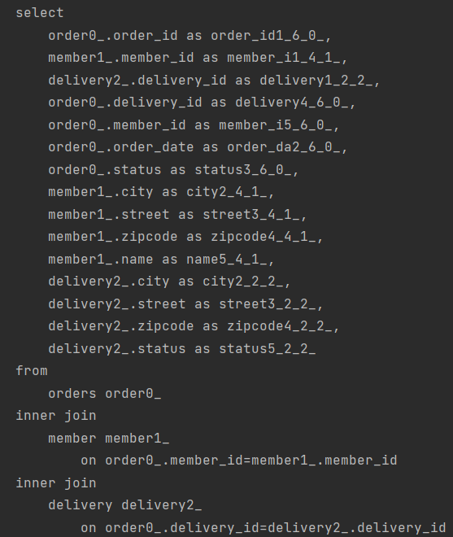
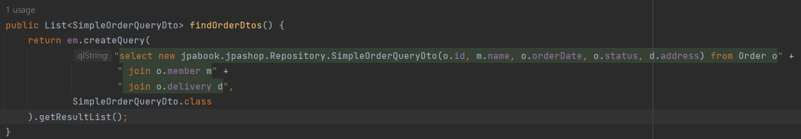

# 지연 로딩과 조회 성능 최적화(중요)

## 1. 엔티티를 직접 노출

**[결과]**

원인 : Order와 Member가 양방향 관계로 설정되어 있기 때문에 무한루프 발생 -> StackOverflow

해결 : @JsonIgnore로 강제로 관계를 끊는다.

**[또 다른 문제]**

원인 : Order -> Member와 Order -> Address는 지연 로딩이기 때문에 실제 엔티티 대신 프록시가 생성된다. 그런데 Jackson 라이브러리는 이 프록시 객체를 Json으로 어떻게 생성해야 하는 지 모르기 때문에 예외 발생

해결 : Hibernate5Module을 스프링빈으로 등록하면 해결 가능

**[결론]**

엔티티를 직접 조회하지 말고 DTO로 변환하여 조회하자.

## 2. 엔티티를 DTO로 변환

**[결과]**

쿼리가 총 1 + N + N번 실행된다. 

- order 1번
- order -> member 지연로딩 조회 N번
- order -> delivery 지연로딩 조회 N번

## 3. 엔티티를 DTO로 변환 + 페치 조인 최적화

**[결과]**

엔티티를 페치 조인을 사용해서 쿼리 1번에 조회

## 4. 엔티티를 DTO로 변환 + DTO 바로 조회

**[결과]**

## 쿼리 방식 선택 권장 순서

1. 엔티티를 DTO로 변환하는 방법
2. 필요하면 페치 조인으로 성능을 최적화한다.
3. DTO로 직접 조회하는 방법을 사용한다.
4. 최후의 방법은 JPA가 제공하는 네이티브 SQL이나 스프링 JBDC Template을 사용해서 SQL을 직접 사용한다.

