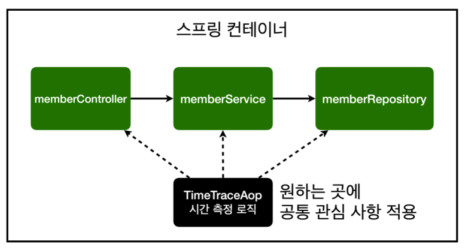
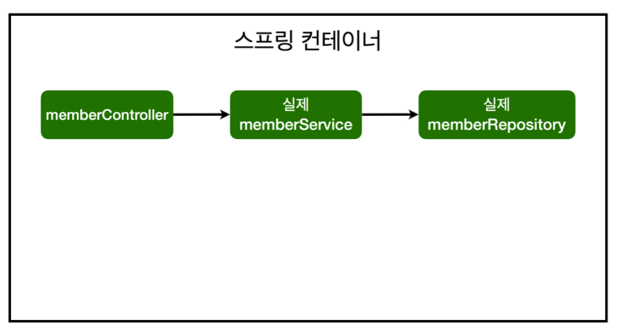
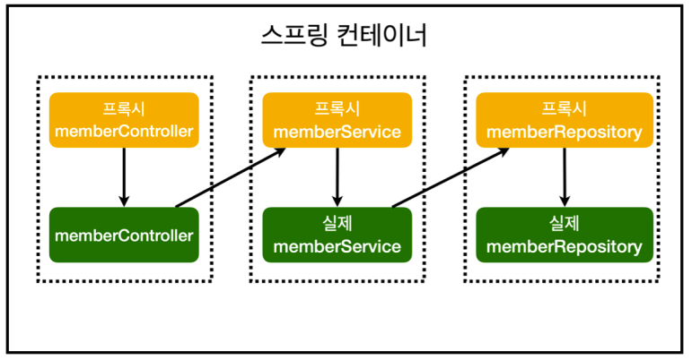

# AOP (Aspect Oriented Programming)

## AOP가 필요한 상황

- 모든 메소드의 호출 시간을 측정하고 싶다면
- 공통 관심 사항 vs 핵심 관심 사항
- 회원 가입 시간, 회원 조회 시간을 측정하고 싶다면

### 핵심 기능에 시간 측정 코드를 작성할 때 문제

- 유지보수가 어려워진다.
- 시간 측정 로직을 변경할 때 모든 로직을 찾아가면서 변경해야 한다.

## AOP 적용

공통 관심 사항과 핵심 관심 사항을 분리

### 해결

- 회원 가입, 회원 조회 등 핵심 관심사항과 시간을 측정하는 공통 관심 사항을 분리한다.
- 핵심 관심 사항을 깔끔하게 유지할 수 있다
- 변경이 필요하면 해당 로직만 변경하면 된다.
- 원하는 적용 대상을 선택할 수 있다.

### AOP 적용 전 의존 관계

### AOP 적용 후 의존 관계

## 키워드

### @Aspect

### ProceedingJoinPoint

### @Around

