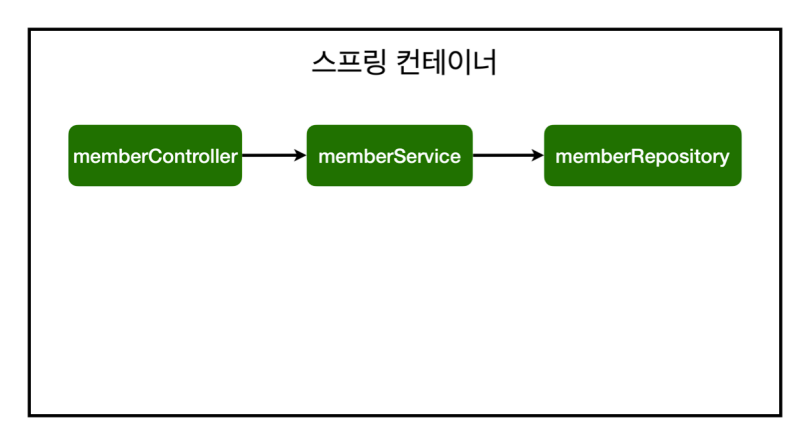

# 컴포넌트 스캔과 자동 의존 관계 설정

## @Controller

스프링이 실행될 때 스프링 컨테이너가 생성되는 데, 이 때 해당 annotation이 붙어 있으면 해당 객체를 생성해서 컨테이너에 넣어둡니다.

## @Autowired

각 상황에 맞는 IoC 컨테이너 안에 존재하는 빈을 자동으로 주입해줍니다.

현재 MemberService는 순수한 자바 클래스이기 때문에 스프링이 MemberService를 찾을 수 없어서 에러가 발생하게 됩니다.

이를 해결하기 위해서 MemberService 클래스에 @Service를 적어 스프링이 실행될 때 스프링 컨테이너에 등록시켜줍니다. MemberRepository 클래스 또한 @Repository를 적어서 등록해 줍니다.

### 스프링 빈 등록

스프링은 스프링 컨테이너에 스프링 빈을 등록할 때, 기본적으로 싱글톤으로 등록합니다.

## 자바 코드로 직접 스프링 빈 등록하기

실무에서는 주로 정형화된 컨트롤러, 서비스, 리포지토리 같은 코드는 컴포넌트 스캔을 사용합니다. 그리고 정형화되지 않거나 상황에 따라 구현 클래스를 변경해야 하는 경우 설정을 통해 스프링 빈으로 등록합니다.

@Configuation을 적은 클래스에 등록할 스프링 빈 객체를 설정할 수 있습니다.

## DI 3가지 방식

### 1. 필드 주입

변경이 불가능하기 때문에 추천하지 않는 방식입니다.

### 2. setter 주입

### 3. 생성자 주입

의존관계가 실행중에 동적으로 변하는 경우는 거의 없기 때문에 생성자 주입이 권장됩니다.

