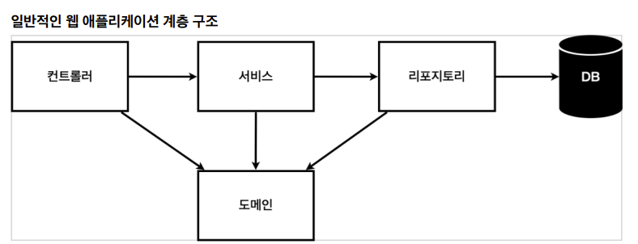
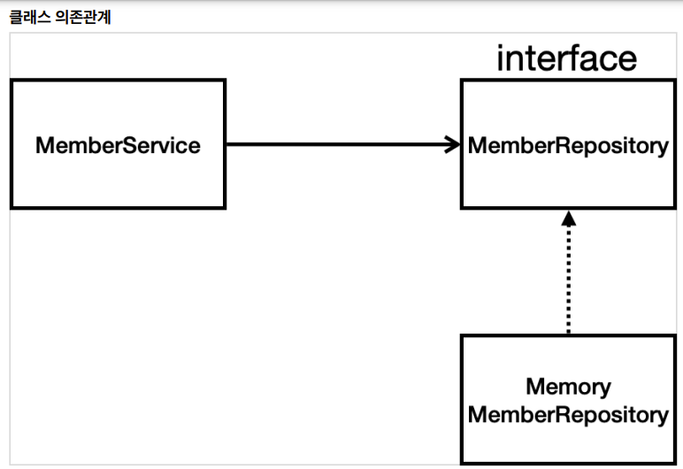

# 스프링 입문

## 비즈니스 요구사항

- 데이터 : 회원 ID, 이름
- 기능 : 회원 등록, 조회



- 컨트롤러 : 웹 MVC의 컨트롤러 역할
- 서비스 : 핵심 비즈니스 로직 구현
- 리포지토리 : 데이터베이스에 접근, 도메인 객체를 DB에 저장하고 관리
- 도메인 : 비즈니스 도메인 객체



## 회원 도메인과 리포지토리

## 회원 리포지토리 테스트 케이스 작성

자바는 JUnit이라는 프레임워크로 테스트를 실행할 수 있다.

### 회원 리포지토리 메모리 구현체 테스트

```java
@Test
public void save() {
    Member member = new Member();
    member.setName("spring");
    repository.save(member);

    Member result = repository.findById(member.getId()).get();
    //Assertoins.
    Assertions.assertThat(member).isEqualTo(result);
}
```

```java
@Test
public void findByName() {
    Member member1 = new Member();
    member1.setName("spring1");
    repository.save(member1);

    Member member2 = new Member();
    member2.setName("spring2");
    repository.save(member2);

    Member result = repository.findByName("spring1").get();
    Assertions.assertThat(result).isEqualTo(member1);
}
```

```java
@Test
public void findAll() {
    Member member1 = new Member();
    member1.setName("spring1");
    repository.save(member1);

    Member member2 = new Member();
    member2.setName("spring2");
    repository.save(member2);

    List<Member> result = repository.findAll();

    Assertions.assertEquals(result.size(), 2);
}
```

각각 테스트를 실행했을 때는 문제가 없지만, 통합 테스트를 실행했을 때 문제가 생긴다. 

모든 테스트는 메서드 순서 상관없이 실행되기 때문에 findall 함수가 먼저 실행되면서 member1, member2가 이미 repository에 저장이 되버려서 findbyname에서 에러가 발생하게 된다.

이 문제를 해결하려면 테스트가 끝날 때마다 데이터를 초기화 해줘야 합니다.

```java
@AfterEach
public void afterEach() {
	repository.clearStore();
}
```

AfterEach 애노테이션이 적힌 함수는 테스트가 끝날 때마다 동작하게 되는 데, 각 테스트가 끝날 때마다 repository를 clear시켜주면 테스트 순서 상관없이 정상 실행 됩니다.

**TDD(Test-Driven Development)** : 테스트 코드를 먼저 작성하는 개발 방법

