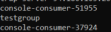
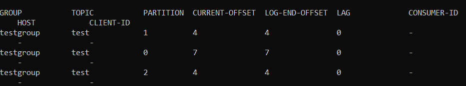
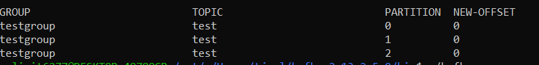
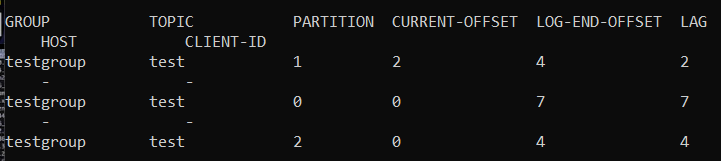

# Kafka 설치. 실행. CLI

## config/server.properties

- broker.id : 정수로 된 브로커 번호. 클러스터 내 고유 번호로 지정
- listens : kafka 통신에 사용되는 host:port
- advertised.listeners : kafka client가 접속할 host:port
- log.dirs : 메시지를 저장할 디스크 디렉토리. 세그먼트가 저장됨.
- log.segment.bytes : 메시지가 저장되는 파일의 크기 단위
- log.retention.ms : 메시지를 얼마나 보존할지 지정. 닫힌 세그먼트를 처리
- zookeeper.connect : 브로커의 메타데이터를 저장하는 주키퍼의 위치
- auto.create.topics.enable : 자동으로 토픽이 생성 여부
- num.partitions : 자동생성된 토픽의 default_partition 개수
- message.max.bytes : kafka broker에 쓰련느 메시지 최대 크기

## Local 설치 및 CLI 실행

### 1. kafka 파일 다운로드 후 압축 해제

```shell
curl https://archive.apache.org/dist/kafka/2.5.0/kafka_2.13-2.5.0.tgz --output kafka.tgz

tar -xvf kafka.tgz
```

### 2. CLI 실행

### 토픽 생성

```shell
./kafka-topics.sh --create --bootstrap-server {aws ec2 public ip}:9092 --replication-factor 1 --partitions 3 --topic test
# replication수는 1이고, 파티션 수는 3개인 토픽 생성
```

### console-producer를 통해서 test 토픽에 데이터 넣기

```shell
./kafka-console-producer.sh --bootstrap-server {aws ec2 public ip}:9092 --topic test
```

### console-consumer를 통해서 test 토픽에 데이터 확인

```shell
./kafka-console-consumer.sh --bootstrap-server {aws ec2 public ip}:9092 --topic test --from-beginning

# from-beginning : 토픽에 있는 첫 offset부터 출력
```

### test 토픽을 testgroup이라는 group으로 지정

```shell
./kafka-console-consumer.sh --bootstrap-server {aws ec2 public ip}:9092 --topic test -group testgroup --from-beginning
```

### consumer group 리스트 출력

```shell
./kafka-consumer-groups.sh --bootstrap-server {aws ec2 public ip}:9092 --list
```



### 특정 컨슈머 그룹이 어떤 상태인지 출력

```shell
./kafka-consumer-groups.sh --bootstrap-server {aws ec2 public ip}:9092 --group testgroup --describe
```



### testgroup에 있는 test 토픽의 offset 리셋

```shell
./kafka-consumer-groups.sh --bootstrap-server {aws ec2 public ip}:9092 --group testgroup --topic test --reset-offsets --to-earliest --execute
# to-earliest : 가장 낮은 숫자의 offset으로 초기화시킨다.
```



### 특정 파티션만 offset을 변경하고자 하는 경우

```shell
./kafka-consumer-groups.sh --bootstrap-server {aws ec2 public ip}:9092 --group testgroup --topic test:1 --reset-offsets --to-offset 2 --execute

# test:1 1번 파티션의 offset을 2로 수정
```



