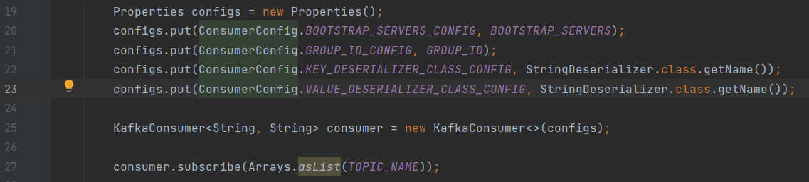
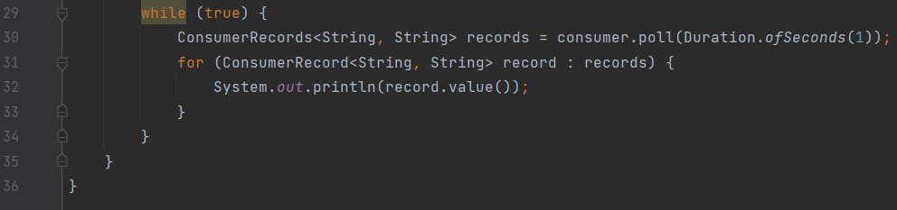
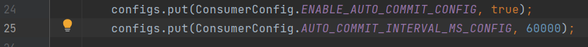
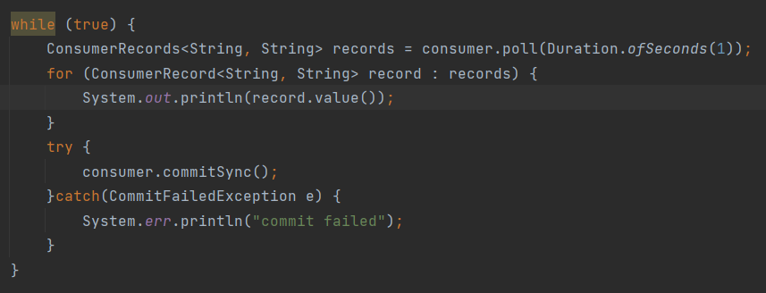
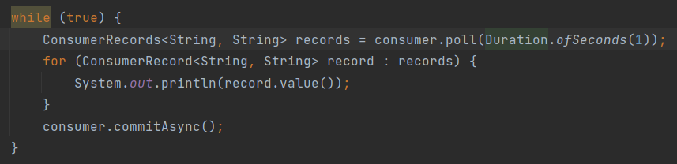
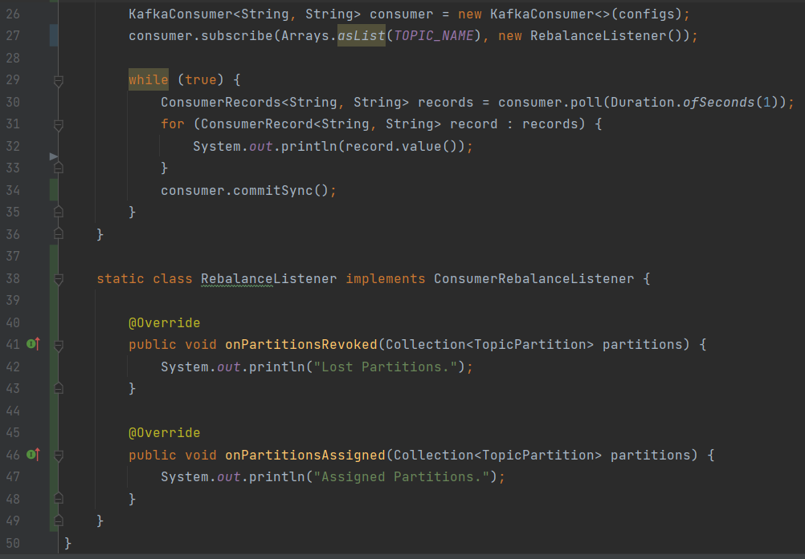
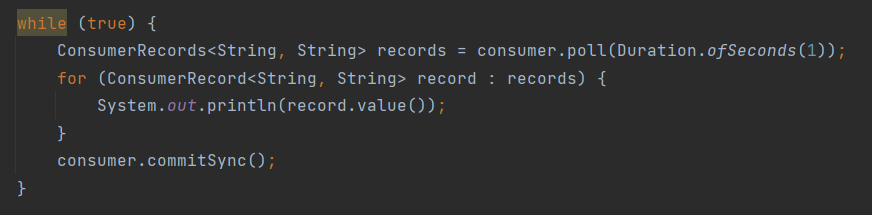
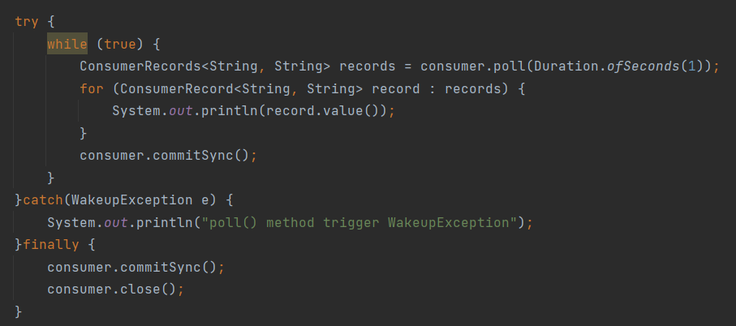
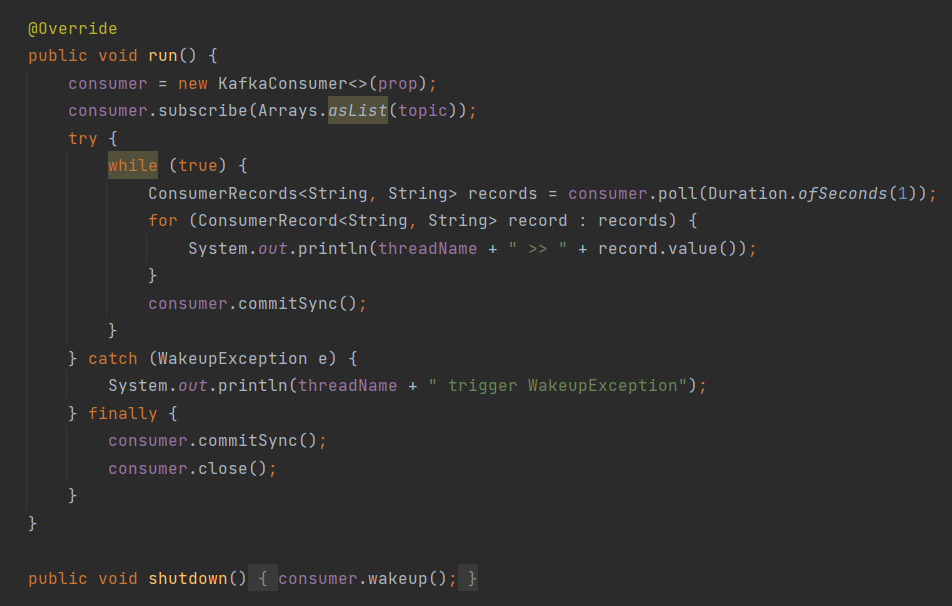
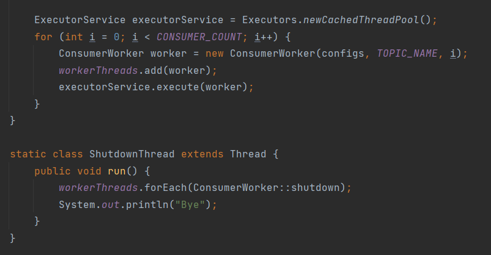

# 카프카 컨슈머

## Consumer

- 데이터를 가져가는(polling) 주체
- commit을 통해 읽은 consumer offset을 카프카에 기록
- Java Kafka-client 제공
- 데이터 저장 장소
  - FileSystem(.csv, .log, .tsv)
  - Object Storage(S3, Minio)
  - Hadoop(hdfs, hive)
  - RDBMS(Oracle, Mysql)
  - Nosql(MongoDB, CouchDB)
  - 기타 다양한 저장소들(엘라스틱 서치, influxDB)

## Simple Consumer

### KafkaConsumer 객체 설정

### Producer로 부터 받은 데이터 출력

## Consumer commit

- enable.auto.commit = true
  - 일정 간격(auto.commit.interval.ms), poll() 메서드 호출시 자동 커밋
  - 커밋 관련 코드를 작성할 필요가 없다.
  - 속도가 가장 빠르다
  - 중복 또는 유실이 발생할 수 있다.
    - 중복/유실을 허용하지 않는 곳에서는 사용하면 안된다.
    - 일부 데이터가 중복/유실되도 상관없는 곳에서 사용한다.

- 데이터 중복을 막을 수 있는 방법

  - auto commit을 사용하지 않는다.
    - Kafka consumer의 commitSync(), commitAsync()를 사용

- enable.auto.commit = false

  1) commitSync() : 동기 커밋

     - ConsumerRecord 처리 순서를 보장한다.
     - 가장 느림 (커밋이 완료될 때까지 block)
     - poll() 메서드로 반환된 ConsumerRecord의 마지막 offset을 커밋
     - Map<TopicParition, OffsetAndMetadata>을 통해 오프셋 지정 커밋 가능

     

  2) commitAsync() : 비동기 커밋

     - 동기 커밋보다 빠르다.
     - 중복이 발생할 수 있다.
       - 일시적인 통신 문제로 이전 offset보다 이후 offset이 먼저 커밋될 때
     - ConsumerRecord 처리 순서를 보장하지 못한다.
       - 처리 순서가 중요한 서비스에서는 사용이 제한된다.

     

## Consumer rebalance

- 리밸런스 - 컨슈머 그룹의 파티션 소유권이 변경될 때 일어나는 현상
  - 리밸런스를 하는 동안 일시적으로 메시지를 가져올 수 없다.
  - 리밸런스 발생 시 데이터 유실/중복 발생 가능성이 있다.
    - commitSync() 또는 unique key등의 방법으로 데이터 유실/중복 방지
  - 리밸런스 발생 시기
    - consumer.close() 호출시 또는 consumer의 세션이 끊어졌을 때
      1) 3초마다 그룹 코디네이터(브로커 중 1대)에게 heartbeat 전송
      2) 10초의 세션 타임 아웃 시간 안에 heartbeat가 왔는 지 확인
      3) 만약 heartbeat가 없으면 해당 컨슈머는 죽은 것으로 마킹
      4) 리밸런스 시작

### Consumer rebalance listener

### Consumer wakeup

**정상 동작 예시**

1. poll() 호출
   - records 100개 반환 : offset 101번 ~ 200번
2. records loop 구문 수행
3. record.value() 출력
4. offset 200 커밋
5. 1~4 반복

**SIGKILL로 인한 중복 처리 발생 예시**

1. poll() 호출
2. records loop 구문 수행
3. record.value() 150번 오프셋 출력 중, SIGKILL 호출
   - 101번 ~ 150번 오프셋은 처리가 됐지만, 151 ~ 200번 오프셋은 미처리
4. offset 200 커밋 불가
   - 브로커에는 100번 오프셋이 마지막 커밋이기 때문에 101번부터 다시 시작
     - 데이터 중복 발생

- wakeup을 통한 graceful shutdown 필수
  - SIGTERM을 통한 shutdown signal로 kill하여 처리한 데이터를 커밋
  - SIGKILL은 프로세스 강제 종료로 커밋이 불가

### Consumer thread 전략

1. 1 프로세스 + 1 스레드(컨슈머)
   - 간략한 코드
   - 프로세스 단위 실행/종료
   - 다수의 컨슈머 실행 필요시 다수의 프로세스가 실행
2. 1 프로세스 + n 스레드(동일 컨슈머 그룹)
   - 복잡한 코드
   - 스레드 단위 실행/종료
   - 스레드간 간섭 주의
   - 다수 컨슈머 실행 시 다수 스레드 실행 가능
3. 1 프로세스 + n 스레드 (다수 컨슈머 그룹)
   - 컨슈머 그룹별 스레드 개수 조절 주의

### ConsumerWorker

### ConsumerWithMultithread

### Consumer lag

- 컨슈머 랙은 컨슈머의 상태를 나타내는 지표
- 컨슈머 랙의 최대값은 컨슈머 인스턴스를 통해 확인할 수 있다.
  - consumer.metrics()를 통해 확인할 수 있는 지표
    - records-lag-max : 토픽의 파티션 중 최대 랙
    - fetch-size-avg : 1번 폴링하여 가져올 때 레코드 byte 평균
    - fetch-rate : 1초동안 레코드를 가져오는 횟수
- 컨슈머 인스턴스를 통한 컨슈머 랙 수집의 문제점
  - 컨슈머 인스턴스 장애가 발생하면 지표 수집 불가
  - 구현하는 컨슈머마다 지표를 수집하는 로직을 개발해야 한다.
  - 컨슈머 랙 최대값만 알 수 있다.
- 컨슈머 랙 모니터링
  - Confluent Platform, Datadog, Kafka Burrow같은 외부 모니터링 애플리케이션을 사용하면 좋다.
- 카프카 버로우
  - 링크드인에서 오픈소스로 제공하는 컨슈머 랙 체크 툴
  - 버로우를 실행하면 카프카, 주키퍼 정보를 통해 랙 정보 자체를 수집
  - 슬라이딩 윈도우를 통한 컨슈머 상태 정의
    - OK : 정상
    - ERROR : 컨슈머가 폴링을 멈춤
    - WARNING : 컨슈머가 폴링을 수행하지만 lag이 계속 증가