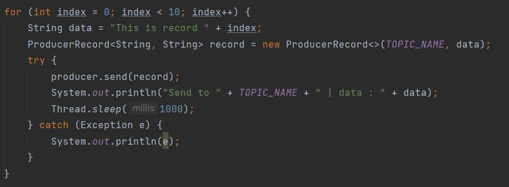
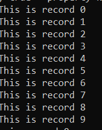
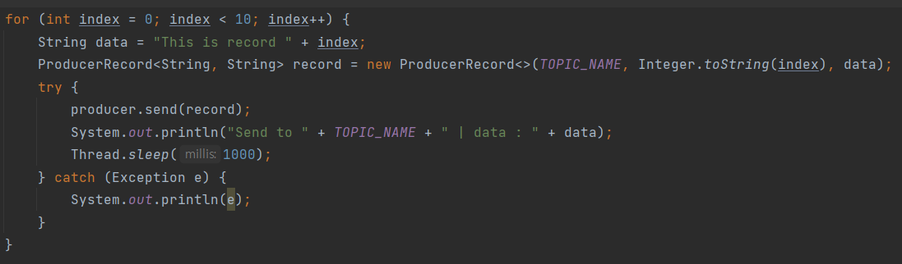
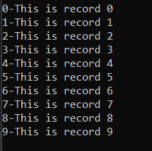
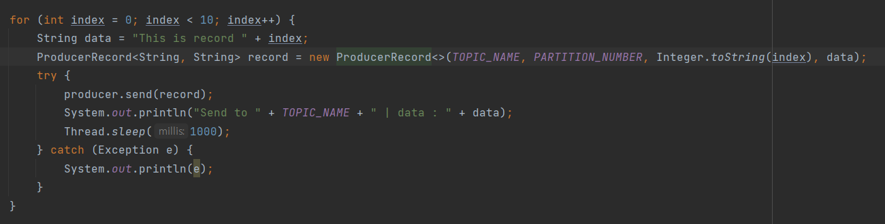

# 카프카 프로듀서

## Consumer 실행

```shell
 ./kafka-console-consumer.sh --bootstrap-server 54.180.103.26:9092 --topic test --property print.key=true --property key.separator="-"
 
 # print.key = true : 키 값 출력
 # key.separator = "-" : value 값 출력
```

## Simple Producer





## key-value를 갖는 Producer





## Record Key

- 레코드 키

  - 역할 : 메시지를 구분하는 구분자 역할

  - 특징

    - 동일 키, 동일 파티션 적재

      - 순서를 보장하므로, 상태머신으로 사용 가능

      - 역할에 따른 컨슈머 할당 적용 가능

    - 레코드 값을 정의하는 구분자

      - 키에 레코드 값 해쉬값을 넣음으로서 중복처리 방지 가능

## Record Value

- 레코드 값

  - 역할 : 실질적으로 전달하고 싶은 데이터

    - String, ByteArray, int 등 제한이 없다.

    - CSV, TSV, JSON, Object 등 서비스의 특징에 맞게 사용 권장
      - json 사용 시 : key/value 형태로서 확장성이 뛰어남. 컬럼 정보(key) 포함
      - csv 사용 시 : 콤마를 기준으로 데이터 구분, 용량에서 이득
    - 포맷을 관리하는 다른 방법?
      - 컨플루언트 스키마 레지스트리(confluentinc/schema-registry)


## 특정 파티션에만 데이터 넣기




## Producer acks

- acks = 0
  - 가장 속도가 빠르지만, 유실 가능성이 있다.
  - 프로듀서가 브로커와 소켓연결을 맺어 보낸 즉시 성공으로 간주한다.
  - 브로커가 정상적으로 받아서 리터 파티션에 저장했는 지 알 수 없다.
  - 팔로워 파티션에도 저장 됐는 지 알 수 없다.
    - 전송 속도가 중요하고 일부가 유실되어도 무관한 데이터에 사용한다.
- acks = 1 (default)
  - 속도는 보통, 유실 가능성이 있다.
  - 프로듀서가 보낸 메시지가 리더 파티션에 정상 저장되었는 지 확인한다.
  - 팔로워 파티션에 저장됐는 지는 모른다.
  - 리터 파티션에 저장되고 해당 브로커가 죽으면 데이터가 유실된다.
    - acks  = 0에 비해 신뢰도는 높지만 유실 가능성이 있다.
- acks = all 또는 -1
  - 속도는 가장 느리지만, 메시지 전달 손실이 없다.
  - 리터 파티션뿐만 아니라 팔로워 파티션까지 복제될 때까지 기다린다.
  - 복제가 완료되기까지 기다리기 때문에 속도가 느리다.
    - 유실 가능성은 없지만 속도가 느리다.

## Producer Options

- 필수 옵션
  1. bootstrap.servers : 카프카 클러스터에 연결하기 위한 브로커 목록
  2. key.serializer : 메시지 키 직렬화에 사용되는 클래스
  3. value.serializer : 메시지 값을 직렬화하는 데 사용되는 클래스
- 선택 옵션
  1. acks : 레코드 전송 신뢰도 조절
  2. compression.type : snappy, gzip, iz4 중 하나로 압축해 전송
  3. retries : 클러스터 장애에 대응하여 메시지 전송을 재시도하는 횟수
  4. buffer.memory : 브로커에 전송될 메시지의 버퍼로 사용 될 메모리 양
  5. batch.size : 여러 데이터를 함께 보내기 위한 레코드 크기
  6. linger.ms : 현재의 배치를 전송하기 전까지 기다리는 시간
  7. client.id : 어떤 클라이언트인지 구분하는 식별자
