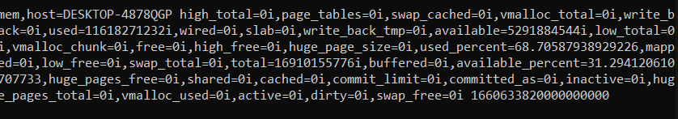
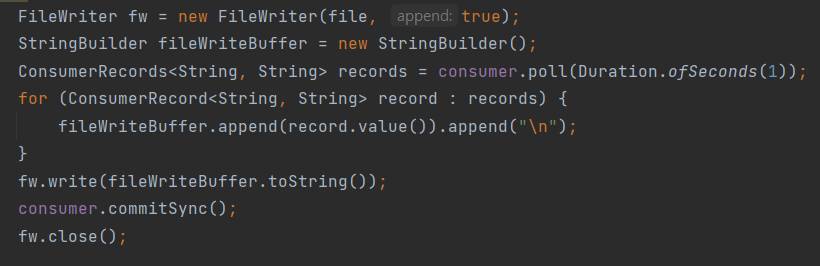
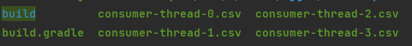

# 카프카 활용 실습

## Metric collect pipeline

- 요구 사항

  - CPU, RAM 정보 수집
    - telegraf agent 사용
    - Telegraf : influxdata에서 오픈소스로 제공하는 플러그인 기반의 메트릭 수집 server agent. 간단한 설정으로 다양한 플러그인을 붙일 수 있다.

  - 파일 단위로 저장
    - write와 함께 flush
    - 파일 포맷은 CSV

- 카프카 관련 정보

  - 토픽명 : my-computer-metric
  - 파티션 개수 : 5개
  - 컨슈머 개수 : 5개
  - 키 활용 여부 : 사용하지 않음

### 1. Topic 생성

```shell
./kafka-topics.sh --create --bootstrap-server {aws ec2 public ip}:9092 --replication-factor 1 --partitions 5 --topic my-computer-metric
```

### 2. Telegraf 설치

- 설치 방법은 구글링

### 3. Telegraf config 저장

```
[agent]
 interval = "10s"
[[outputs.kafka]]
 brokers = ["{aws ec2 public ip}:9092"]
 ## Kafka topic for producer messages
 topic = "my-computer-metric"
[[inputs.cpu]]
 percpu = true
 totalcpu = true
 fielddrop = ["time_*"]
[[inputs.mem]]
```

### 4. Telegraf 실행

```shell
$telegraf --config telegraf.conf
```

### 5. kafka-console-consumer 데이터 확인



### 6. Kafka consumer application 개발

- file write는 자바에서 제공하는 FileWriter 클래스 사용

### 7. multiple thread 사용, group.id 지정



### 8. 파일 적재 확인

