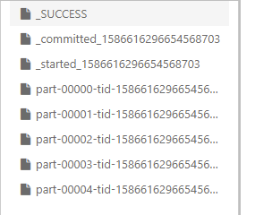
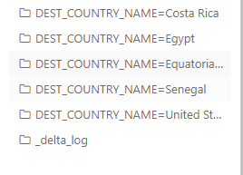
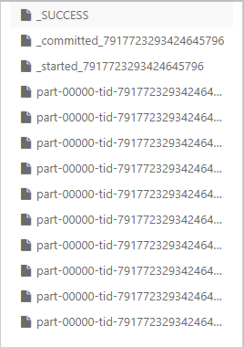

# 데이터소스

## 목표

- 스파크의 핵심 데이터소스를 이용해 데이터를 읽고 쓰는 방법을 터득하고, 서드파티 데이터소스와 스파크를 연동할 때 무엇을 고려해야 하는 지


## 데이터 소스 API 구조

### 읽기 API 구조

```python
DataFrameReader.format(...).option("key", "value").schema(...).load()
```

- 모든 데이터소스를 읽을 때는 위와 같은 형식을 사용합니다.
- format 메서드는 선택적으로 사용할 수 있으며, 기본값은 파케이입니다.
- option 메서드를 사용해 데이터를 읽는 방법에 대한 파라미터를 키-값 쌍으로 설정할 수 있습니다.
- schema 메서드는 데이터 소스에서 스키마를 제공하거나, 스키마 추론 기능을 사용하려는 경우에 선택적으로 사용할 수 있습니다.

### 데이터 읽기 기초

- 스파크에서 데이터를 읽을 때는 기본적으로 DataFrameReader를 사용합니다. DataFrameReader는 SparkSession의 read 속성으로 접근합니다.

  ```scala
  spark.read.format("csv")
  	 .option("mode", "FAILFAST")
  	 .option("inferSchema", "true")
       .option("path", "file_path")
  	 .schema(mySchema)
  	 .load()
  ```

  **읽기 모드**

  - 읽기 모드는 스파크가 형식에 맞지 않는 데이터를 만났을 때의 동작 방식을 지정하는 옵션입니다.

    | 읽기 모드     | 설명                                                         |
    | ------------- | ------------------------------------------------------------ |
    | permissive    | 오류 레코드의 모든 필드를 null로 설정하고, 모든 오류 레코드를 _corrupt_record라는 문자열 컬럼에 기록합니다 |
    | dropMalformed | 형식에 맞지 않는 레코드가 포함된 로우를 제거합니다           |
    | failFast      | 형식에 맞지 않는 레코드를 만나면 즉시 종료합니다.            |

### 쓰기 API 구조

```python
DataFrameWriter.format(...).option(...).partitionBy(...).bucketBy(...).sortBy(...).save()
```

- option까지는 읽기 API와 유사합니다
- paritionBy, bucketBy, sortBy 메서드는 파일 기반 데이터소스에서만 동작하며, 이 기능으로 최종 파일 배치 형태를 제어할 수 있습니다.

### 데이터 쓰기 기초

- 데이터소스에 항상 데이터를 기록해야 하기 때문에 데이터프레임의 write 속성을 이용해 데이터프레임 별로 DataFrameWriter에 접근해야 합니다.

- DataFrameWriter를 얻은 다음에 포맷, 옵션, 저장 모드를 지정해야 하며,  데이터가 저장될 경로를 반드시 입력해야 합니다.

  ```scala
  dataFrame.write.format("csv")
  	.option("mode", "OVERWRITE")
  	.option("dateFormat", "yyyy-MM-dd")
  	.option("path", "file_path")
  	.save()
  ```

  **저장 모드**

  - 스파크가 지정된 위치에서 동일한 파일을 발견했을 때 동작 방식을 지정하는 옵션입니다.

    | 저장 모드     | 설명                                                         |
    | ------------- | ------------------------------------------------------------ |
    | append        | 해당 경로에 이미 존재하는 파일 목록에 결과 파일을 추가합니다 |
    | overwrite     | 이미 존재하는 모든 데이터를 덮어씁니다                       |
    | errorIfExists | 해당 경로에 데이터나 파일이 존재하는 경우 오류를 발생시키면서 쓰기 작업이 실패합니다 |
    | ignore        | 해당 경로에 데이터나 파일이 존재해도 아무런 처리도 하지 않습니다. |


## CSV 파일

- CSV 파일은 구조적으로 보이지만, 사실 매우 까다로운 파일 포맷 중 하나입니다. 그 이유는 운영환경에서 어떤 내용이 들어 있는 지, 어떤 구조로 되어 있는 지 등 다양한 전제를 만들어낼 수 없기 때문입니다.

  그렇기 때문에 CSV reader는 많은 수의 옵션을 제공합니다.

### CSV 파일 읽기

- CSV 파일을 읽으려면 CSV용 DataFrameReader를 생성해야 합니다.

  ```scala
  spark.read.format("csv")
  	.option("header", "true")
  	.option("mode", "FAILFAST")
  	.option("inferSchema", "true")
  	.load("file_path/file.csv")
  ```

- 읽기 모드와 생성한 스키마를 파일의 데이터가 예상한 형태로 이루어져 있음을 검증하는 용도로 사용할 수 있습니다

  ```scala
  import org.apache.spark.sql.types.{StructField, StructType, StringType, LongType}
  
  val myManualSchema = new StructType(Array( 
  StructField("DEST_COUNTRY_NAME", StringType, true), StructField("ORIGIN_COUNTRY_NAME", StringType, true), StructField("count", LongType, false)
  ))
  
  spark.read.format("csv")
    .option("header", "true")
    .option("mode", "FAILFAST")
    .schema(myManualSchema)
    .load("/FileStore/tables/2010_summary.csv")
    .take(5)
  
  // 정상 동작
  // 타입이 맞지 않으면 오류가 발생합니다.
  ```

  - 스파크는 지연연산 특성이 있으므로 데이터프레임 정의 시점이 아닌 job 실행 시점에만 오류가 발생합니다. 예를 들어 데이터프레임을 정의하는 시점에는 존재하지 않는 파일을 지정해도 오류가 발생하지 않습니다.

### CSV 파일 쓰기

```scala
csvFile.write.format("csv").mode("overwrite").option("sep", "\t")
		.save("/tmp/my-tsv-file.tsv")
```


## JSON 파일

- 스파크에서는 json 파일을 사용할 때 줄로 구분된 json을 기본적으로 사용합니다.
- multiLine 옵션을 사용해 줄로 구분된 방식과 여러 줄로 구성된 방식을 선택적으로 사용할 수 있습니다. 이 옵션을 true로 하면 전체 파일을 하나의 json 객체로 읽을 수 있습니다.
- 줄로 구분된 json은 전체 파일을 읽은 다음 저장하는 방식이 아니므로 새로운 레코드를 추가할 수 있습니다.
- Json 객체는 구조화되어 있고, 최소한의 기본 데이터 타입이 존재하기 때문에 더 안정적입니다.

### Json 파일 읽기

- 앞에서 설명한 CSV 파일과 동일합니다.

### Json 파일 쓰기

-  앞에서 설명한 CSV 파일과 동일합니다.


## 파케이 파일

- 다양한 스토리지 최적화 기술을 제공하는 오픈소스로 만들어진 컬럼 기반의 데이터 저장 방식입니다. 특히 분석 워크로드에 최적화 되어 있습니다.
- 저장소를 절약할 수 있고, 전체 파일을 읽는 대신 개별 컬럼을 읽을 수 있으며, 컬럼 기반의 압축 기능을 제공합니다.
- 아파치 스파크와 호환이 잘 되기 때문에 기본 파일 포맷입니다.
- 파케이 파일은 읽기 연산 시 json이나 csv보다 훨씬 효율적으로 동작하므로 장기 저장용 데이터는 파케이 포맷으로 저장하는 것이 좋습니다.
- 복합 데이터 타입을 지원합니다. 컬럼이 배열, 맵, 구조체 데이터 타입이라 해도 문제없이 읽고 쓸 수 있습니다.

### 파케이 파일 읽기

- 데이터를 저장할 때 자체 스키마를 사용하기 때문에 옵션이 거의 없습니다.
- 파케이 파일은 스키마가 파일 자체에 내장되어 있으므로 추정이 필요 없습니다.

```scala
spark.read.format("parquet")
      .load("/FileStore/tables/2010-summary.parquet").show(5)

+-----------------+-------------------+-----+
|DEST_COUNTRY_NAME|ORIGIN_COUNTRY_NAME|count|
+-----------------+-------------------+-----+
|    United States|            Romania|    1|
|    United States|            Ireland|  264|
|    United States|              India|   69|
|            Egypt|      United States|   24|
|Equatorial Guinea|      United States|    1|
+-----------------+-------------------+-----+
```

### 파케이 파일 쓰기

```scala
csvFile.write.format("parquet").mode("overwrite")
		.save("/tmp/my-parquet-file.parquet")
```


## ORC 파일

- ORC는 하둡 워크로드를 위해 설계된 자기 기술적이며 데이터 타입을 인식할 수 있는 컬럼 기반의 파일 포맷입니다.이 포맷은 대규모 스트리밍 읽기에 최적화되어 있을 뿐만 아니라 필요한 로우를 신속하게 찾아낼 수 있는 기능이 통합되어 있습니다.
- 스파크는 ORC 파일 포맷을 효율적으로 사용할 수 있으므로 별도의 옵션 지정 없이 데이터를 읽을 수 있습니다. 
- 파케이와 차이점은 파케이는 스파크에 최적화된 반면 ORC는 하이브에 최적화되어 있다는 겁니다.

### ORC 파일 읽기

```scala
spark.read.format("orc").load("/FileStore/tables/orc/2010-summary.orc").show(5)

+-----------------+-------------------+-----+
|DEST_COUNTRY_NAME|ORIGIN_COUNTRY_NAME|count|
+-----------------+-------------------+-----+
|    United States|            Romania|    1|
|    United States|            Ireland|  264|
|    United States|              India|   69|
|            Egypt|      United States|   24|
|Equatorial Guinea|      United States|    1|
+-----------------+-------------------+-----+
```

### ORC 파일 쓰기

```scala
csvFile.write.format("orc")
.mode("overwrite")
.save("/tmp/my-orc-file.orc")
```


## SQL 데이터베이스


## 텍스트 파일

### 텍스트 파일 읽기

- textFile 메서드에 텍스트 파일을 지정하기만 하면 됩니다.

- 파티션된 텍스트 파일을 읽거나 쓰려면 읽기 및 쓰기 시 파티션 수행 결과로 만들어진 디렉토리를 인식할 수 있도록 text 메서드를 사용해야 합니다.

  ```scala
  spark.read.textFile("/FileStore/tables/2010_summary.csv")
  .selectExpr("split(value, ',') as rows").show(5)
  
  +--------------------+
  |                rows|
  +--------------------+
  |[DEST_COUNTRY_NAM...|
  |[United States, R...|
  |[United States, I...|
  |[United States, I...|
  |[Egypt, United St...|
  +--------------------+
  ```

### 텍스트 파일 쓰기

- 텍스트 파일을 쓸 때는 문자열 컬럼이 하나만 존재해야 합니다.

  ```scala
  csvFile.select("DEST_COUNTRY_NAME").write.text("/tmp/simple-text-file.txt")
  ```


## 고급 I/O 개념

- 쓰기 작업 전에 파티션 수를 조절함으로써 병렬로 처리할 파일 수를 제어할 수 있습니다.
- 버켓팅과 파티셔닝을 조절함으로써 데이터의 저장 구조를 제어할 수 있습니다.

### 분할 가능한 파일 타입과 압축 방식

- 특정 파일 포맷은 분할을 지원합니다. 따라서 스파크 전체 파일이 아닌 쿼리에 필요한 부분만 읽을 수 있으므로 성능 향상에 도움이 됩니다.
- 파케이, GZIP 압축 방식

### 병렬로 데이터 읽기

- 여러 익스큐터가 여러 파일을 동시에 읽을 수 있습니다.
- 다수의 파일이 존재하는 폴더를 읽을 때 폴더의 개별 파일은 데이터프레임의 파티션이 됩니다. 따라서 사용 가능한 익스큐터를 이용해 병렬로 파일을 읽습니다.

### 병렬로 데이터 쓰기

- 파일이나 데이터 수는 데이터를 쓰는 시점에 데이터프레임이 가진 파티션 수에 따라 달라질 수 있습니다.

- 예로 다음 코드는 폴더 안에 5개의 파일을 생성합니다.

  ```scala
  csvFile.repartition(5).write.format("csv").save("/tmp/multiple.csv")
  ```

  

**파티셔닝**

- 어떤 데이터를 어디에 저장할 것인지 제어할 수 있는 기능입닌다. 파티셔닝된 디렉토리 또는 테이블에 파일을 쓸 때 디렉토리별로 컬럼 데이터를 인코딩해 저장합니다.

- 데이터를 읽을 때 필요한 컬럼의 데이터만 읽을 수 있습니다.

  ```scala
  csvFile.limit(10).write.mode("overwrite").partitionBy("DEST_COUNTRY_NAME").save("/tmp/partitioned-files.parquet")
  ```

  

- 파티셔닝은 필터링을 자주 사용하는 테이블을 가진 경우 사용할 수 있는 가장 쉬운 최적화 방식입니다.

**버켓팅**

- 동일한 버킷 id를 가진 데이터가 하나의 물리적 파티션에 모두 모여 있기 때문에 데이터를 읽을 때 셔플을 피할 수 있습니다. 데이터가 이후의 사용 방식에 맞춰 사전에 파티셔닝되므로 조인이나 집계 시 발생하는 고비용의 셔플을 피할 수 있습니다.

  ```scala
  val numberBuckets = 10
  val columnToBucketBy = "count"
  
  csvFile.write.format("parquet").mode("overwrite")
  		.bucketBy(numberBuckets, columnToBucketBy).saveAsTable("bucketedFiles")
  ```

  


### 복합 데이터 유형 쓰기

- CSV는 복합 데이터 타입을 지원하지 않지만, 파케이나 ORC는 지원합니다

### 파일 크리 관리

- 파일 크기 관리는 데이터를 읽을 때 중요한 요소 중 하나입니다.

- 작은 파일을 많이 생성하면 메타데이터에 엄청난 관리 부하가 발생합니다. HDFS 시스템은 작은 크기의 파일을 잘 다루지 못합니다. 파일의 크기가 너무 큰 경우도 문제가 됩니다.

  ```scala
  csvFile.write.option("maxRecordsPerFile", 5000)
  
  //스파크는 파일당 최대 5000개의 로우를 포함하도록 보장할 수 있다.
  ```


## 정리

스파크에서 데이터를 읽고 쓸 때 사용할 수 있는 다양한 옵션을 알아보았습니다. 사용자 정의 데이터 소스를 구현하는 방법도 있는 데, 이와 관련된 사례로 카산드라 커넥터가 있습니다. 