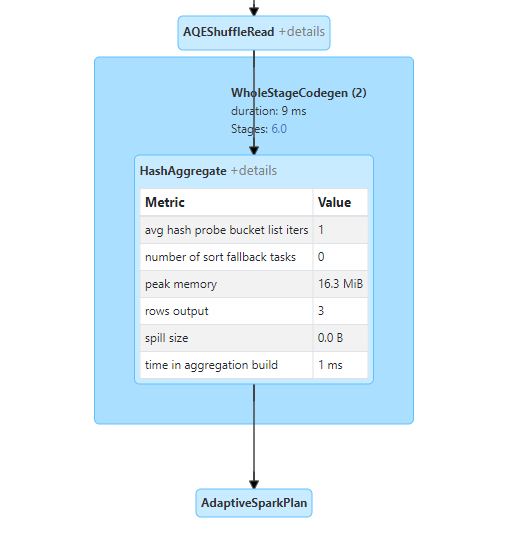

# 모니터링과 디버깅

## 1. 모니터링 범위

스파크 잡의 어느 지점에서 오류가 발생했는 지 파악하려면 스파크 잡을 모니터링해야 합니다. 그러므로 실제 모니터링 대상과 필요한 옵션을 알아야 합니다.

- 스파크 애플리케이션과 잡
  - 스파크 UI와 스파크 로그는 실행중인 애플리케이션의 RDD와 쿼리 실행 계획 같은 개념적 수준의 정보를 제공합니다.
- JVM
  - 스파크는 모든 익스큐터를 개별 JVM에서 실행합니다. 따라서 코드가 실행되는 과정을 이해하려면 각 가상 머신을 모니터링해야 합니다. JVM 도구에는 스택 트레이스를 제공하는 jstack, 힙 덤프를 생성하는 jmap, 시계열 통계 리포트를 제공하는 jstat, 다양한 JVM 속성 변수를 시각화된 방식으로 탐색할 수 있는 jconsole 등이 있습니다.
- os와 머신
  - JVM은 호스트 운영 시스템에서 실행됩니다. 따라서 머신의 상태를 모니터링해 정상 작동 중인지 확인하는 것은 매우 중요합니다. CPU, 네트워크, I/O 등의 자원에 대한 모니터링도 함께 해야 합니다. dstat, iostat, iotop같은 명령어로 세밀하게 모니터링 할 수 있습니다.
- 클러스터
  - 모니터링 솔루션을 활용하면 클러스터가 동작하지 않는 상황을 빠르게 알아낼 수 있습니다. 대표적인 클러스터 모니터링 도구는 강글리아와 프로메테우스가 있습니다.


## 2. 모니터링 대상

모니터링 대상은 다음과 같이 크게 두 가지로 나눌 수 있습니다.

- 실행 중인 사용자 애플리케이션의 프로세스(cpu, 메모리 사용률)

- 프로세스 내부에서의 쿼리 실행 과정(잡과 태스크)

  

### 2-1. 드라이버와 익스큐터 프로세스

- 스파크 애플리케이션을 모니터링 할 때는 스파크 드라이버를 유심히 관찰해야 합니다.

- 익스큐터의 상태를 파악하는 것 또한 매우 중요한 요소 중 하나입니다. 스파크는 수월한 모니터링을 지원하기 위해 드롭위자드 메트릭 라이브러리 기반의 메트릭 시스템을 갖추고 있습니다. 메트릭 시스템은 $SPARK_HOME/conf/metrics.properties 파일을 생성해 구성할 수 있습니다.

### 2-2. 쿼리, 잡, 스테이지, 태스크

- 스파크는 쿼리, 잡, 스테이지, 태스크의 개념을 가지고 있으며, 각각의 정보를 확인 할 수 있습니다. 이러한 정보는 클러스터에서 특정 시점에 실행되는 작업을 파악할 수 있으며 성능 개선이나 디버깅 시 매우 유용합니다.


## 3. 스파크 로그

- 스파크를 가장 상세하게 모니터링하는 방법 중 하나

- 스파크 애플리케이션의 로그나 스파크 자체 로그에서 발견된 이상한 이벤트는 잡의 실패 지점이나 원인을 파악하는 데 큰 도움이 됩니다.

- 파이썬의 경우 스파크의 자바 기반 로깅 라이브러리를 사용할 수 없기 때문에 logging 모듈 또는 print 구문을 사용해 표준 오류로 결과를 출력해야 합니다.
- 로컬 모드로 애플리케이션을 실행한다면 로그 자체가 표준 오류로 출력되지만, 클러스터에서 스파크를 실행한다면 클러스터 매니저로 파일에 저장할 수 있습니다.


## 4. 스파크 UI

- 실행 중인 애플리케이션과 스파크 워크로드에 대한 평가지표를 모니터링할 수 있는 화면을 제공합니다.
- 사용자는 스파크 UI의 탭에서 모니터링하려는 항목에 접근할 수 있습니다.
  - Jobs : 스파크 잡에 대한 정보 제공
  - Stages : 개별 스테이지(태스크 포함) 관련 정보 제공
  - Storage : 스파크 애플리케이션에 캐싱된 정보 제공
  - Environment : 스파크 애플리케이션의 구성과 설정 관련 정보 제공
  - Executors : 애플리케이션이 사용 중인 익스큐터의 상세 정보 제공
  - SQL : SQL과 DataFrame을 포함한 구조적 API 쿼리 정보 제공


```python
spark.read\
    .option("header", "true")\
    .csv("/FileStore/tables/all/online_retail_dataset.csv")\
    .repartition(2)\
    .selectExpr("instr(Description, 'GLASS') >= 1 as is_glass")\
    .groupBy("is_glass")\
    .count()\
    .collect()
```

### 스테이지 1


- Scan csv는 csv 파일을 모두 스캔하는 스테이지입니다. 하단의 상자는 파티션 재분배로 인해 발생하는 셔플 스테이지를 나타냅니다.

### 스테이지 2


- 프로젝션(컬럼 선택/추가/필터링)과 집계를 수행합니다. 
- 그림을 보면 6개의 로우가 반환 된 것을 확인 할 수 있습니다.
- 스파크는 최종 단계를 위하 준비 작업으로 데이터를 셔플하기 전에 파티션별로 집계를 수행합니다. 위 같은 경우는 해시 기반의 집계를 수행합니다. 따라서 파티션 별 집계 결과 수와 파티션 수를 곱하면 로우 수를 계산할 수 있습니다.


### 스테이지 3

- 이전 스테이지의 결과에 대한 집계를 수행합니다. 이전 스테이지 두 개 결과 파티션을 결합해 예제 쿼리의 결과로 세 개 로우를 반환합니다.



### 기타 스파크 UI 탭

- Storage : 클러스터에 캐시된 RDD나 DataFrame과 관련된 정보를 제공하며 시간이 지나 캐시된 데이터가 사라졌는 지 확인할 수 있습니다. 
- Environment : 클러스터에 설정된 다양한 스파크 속성뿐만 아니라 스칼라나 자바와 관련된 정보 등 런타임 환경 관련 정보를 제공합니다.


### 4-1. 스파크 REST API

- 스파크 REST API를 통해서도 스파크의 상태와 메트릭을 확인 할 수 있습니다.

- 스파크 UI와 거의 동일하지만 SQL 정보는 제공되지 않습니다.


### 4-2. 스파크 UI 히스토리 서버

- 정상적으로 종료되거나 비정상적으로 종료된 애플리케이션의 정보를 확인할 때 사용한다.
- 스파크 히스토리 서버를 사용하려면 특정 경로에 이벤트 로그를 저장하도록 설정해야 합니다.
  - spark.eventLog.enabled = true
  - spark.eventLog.dir = 이벤트 로그 저장 경로
- 이벤트 로그가 저장되면 스파크 히스토리 서버를 스탠드얼론 애플리케이션 형태로 실행할 수 있습니다.


## 5. 디버깅 및 스파크 응급 처치

- 사용자가 자주 경험할 수 있는 문제들과 잠재적 대응법을 알아보겠습니다.

### 5-1. 스파크 애플리케이션이 시작되지 않는 경우

#### 징후와 증상

- 스파크 잡이 시작되지 않습니다.
- 스파크 UI가 드라이버 노드를 제외한 클러스터 노드 정보를 전혀 표시하지 않습니다.
- 스파크 UI가 잘못된 정보를 표시하는 것 같습니다.

#### 잠재적 대응법

주요 원인

- 주로 클러스터나 사용자 애플리케이션의 실행에 필요한 자원을 적절하게 설정하지 않았을 때 발생합니다.
- 스파크 클러스터를 구축하는 과정에서 잘못된 설정을 했다면 드라이버와 익스큐터 간의 통신에 문제가 발생할 수 있습니다.
- 사용자 애플리케이션에서 익스큐터 자원을 클러스터 매니저의 유휴 자원 이상으로 요청하는 경우

대응책

- 설정한 포트로 클러스터 머신 간에 통신할 수 있는 지 확인.
- 스파크 자원 설정이 올바른지, 클러스터 매니저가 스파크를 실행할 수 있도록 적합하게 설정되었는 지 확인.


### 5-2. 스파크 애플리케이션 실행 전에 오류가 발생한 경우

#### 징후와 증상

- 명령이 전혀 실행되지 않으며 오류 메시지가 출력됩니다.
- 스파크 UI에서 잡, 스테이지, 태스크의 정보를 확인할 수 있습니다.

#### 잠재적 대응법

- 애플리케이션 정보가 올바른 지 확인한 다음, 코드를 검토합니다.
- 클러스터 드라이버, 워커 그리고 사용하는 저장소 시스템 간의 네트워크 연결 상태를 다시 한번 확인합니다.


### 5-3. 스파크 애플리케이션 실행 중에 오류가 발생한 경우

#### 징후와 증상

- 하나의 스파크 잡이 전체 클러스터에서 성공적으로 실행되지만 다음 잡은 실패
- 여러 단계로 처리되는 쿼리의 특정 단계에서 실패
- 어제 정상 동작한 작업이 실패
- 오류 메시지를 해석하기 어렵다.

#### 잠재적 대응법

- 데이터가 존재하는 지 혹은 올바른 포맷인지 확인
- 쿼리 실행 즉시 오류가 발생한다면 쿼리 실행 계획에서 발생한 오류일 가능성이 높다. (쿼리에 잘못된 컬럼명 입력, 존재하지 않는 컬럼, 뷰, 테이블 참조)
- 어떤 컴포넌트가 연관되어 있는 지 알아내기 위해 스택 트레이스를 분석해 단서를 찾습니다.
- 잡의 태스크가 잠시 실행되다가 비정상적으로 종료된다면 입력 데이터 자체의 문제일 수 있습니다.


### 5-4. 느리거나 뒤처진 태스크

#### 징후와 증상

- 스파크 스테이지에서 대부분 태스크가 정상적으로 실행되고, 소수의 태스크만 남은 상태
- 스파크 UI에서 첫 번째 증상과 같은 느린 태스크를 확인할 수 있고, 동일한 데이터셋을 다룰 때 항상 발생한다.
- 여러 스테이지에서 번갈아 가며 두 번째 증사와 같은 현상이 발생
- 머신 수를 늘려도 성능이 개선되지 않을 때
- 스파크 메트릭을 보면 특정 익스큐터가 다른 익스큐터에 비해 훨씬 많은 데이터를 읽거나 쓰고 있음을 알 수 있다.

#### 잠재적 대응법

다양한 이유가 있지만, 일반적으로 DataFrame이나 RDD 파티션에 데이터가 균등하게 분할되지 않은 경우에 주로 발생합니다.

- 파티션 별 데이터 양을 줄이기 위해 파티션 수를 증가시킨다.
- 다른 컬럼을 조합해 파티션을 재분배합니다. (데이터 치우침이 심한 컬럼을 파티셔닝하거나, 컬럼에서 많은 값이 null이면 느린 태스크가 발생할 수 있습니다. 후자의 경우 null 값을 먼저 필터링하는 것이 합리적입니다.)
- 익스큐터의 메모리를 증가시킨다
- 익스큐터에 문제가 있는 지 모니터링하고 문제가 있다면 다른 잡에서도 동일한 문제가 있는 지 확인합니다. 또한 클러스터에 비정상적인 익스큐터나 머신이 있는 지 확인해야 합니다.
- 사용자 정의 함수를 구현할 때 객체 할당이나 비즈니스 로직에서 쓸모없는 부분이 있는 지 확인하고 가능하면 DataFrame 코드로 변환
- DataSet을 다룰 때 문제가 발생할 수 있습니다. DataSet은 레코드를 사용자 정의 함수의 자바 객체로 변환하기 위해 수많은 객체를 생성하기 때문에 GC(가비지 컬렉션)가 빈번하게 발생할 수 있습니다.

원인이 다양하기 때문에 디버깅하기 가장 어려운 문제 중 하나입니다. 대부분 데이터 치우침 현상으로 발생합니다.


### 5-5. 느린 집계 속도

#### 징후와 증상

- groupBy 호출 시 느린 태스크가 발생
- 집계 처리 이후의 잡도 느리다

#### 잠재적 대응법

- 집계 연산 전 파티션 수를 증가시킨다.
- 익스큐터 메모리를 증가시킨 경우 데이터가 많은 키를 처리하는 익스큐터는 여전히 느릴 수 있지만, 데이터를 디스크에 저장하는 빈도를 줄여 이전보다 더 빠르게 처리할 수 있습니다.
- 집계 처리가 끝나고 이어서 실행되는 태스크가 느리다면 집계 처리도니 데이터셋에 불균형 현상이 남아 있음을 의미합니다. 이 경우는 repartition 명령으로 파티션을 재분배 해줍니다.
- null 값을 나타내기 위해 " " 또는 "EMPTY" 같은 값을 대체 값으로 사용하는 지 확인합니다. 스파크는 잡 실행 전 null 값을 건너뛰기 위한 최적화를 수행합니다. null 대신 대체 기호를 사용하면 최적화를 수행할 수 없습니다.


### 5-6. 느린 조인 속도

#### 징후와 증상

- 조인 스테이지의 처리 시간이 오래 걸립니다.
- 조인 전후의 스테이지는 정상적으로 동작합니다.

#### 대응법

- 많은 조인 연산은 다른 조인 타입으로 변경해 최적화 할 수 있습니다.
- 조인 순서를 변경하면서 잡의 처리 속도가 올라가는 지 테스트
- 조인을 수행하기 전에 데이터셋을 분할하면 클러스터 노드 간 데이터 이동을 줄일 수 있습니다. 동일한 데이터셋이 여러 조인 연산에 사용될 때 유용함. 또한 다양한 사전조인 파티셔닝 기법을 실험해봐야 합니다.
- 데이터 치우침 현상은 느린 조인을 유발할 수 있습니다
- 모든 필터와 select 구문이 조인 연산보다 우선 처리된다면 필요한 데이터만 이용해서 조인을 수행할 수 있다


### 5-7. 느린 읽기와 쓰기 속도

#### 징후와 증상

- 분산 파일 시스템이나 외부 시스템의 데이터를 읽는 속도가 느립니다.
- 네트워크 파일 시스템이나 blob 저장소에 데이터를 쓰는 속도가 느립니다.

#### 잠재적 대응법

- 스파크의 투기적 실행(spark.speculation 속성을 true로 설정)을 사용. 투기적 실행은 강력한 기능이며 일관성을 보장하는 파일 시스템과 함께 사용하는 것이 좋다. 따라서 사용 중인 저장소 시스템의 커넥터가 쓰기 일관성을 지원하는 지 확인해야 합니다.
- 네트워크 성능에 문제가 없는 지 확인
- 단일 클러스터에서 스파크와 HDFS 같은 분산 파일 시스템을 함께 구성하려면 클러스터의 노드마다 스파크와 분산 파일 시스템 모두 동일한 호스트명을 인식하는 지 확인


### 5-8. 드라이버 OutOfMemoryError 또는 응답없음

#### 징후와 증상

- 스파크 애플리케이션이 응답하지 않거나 비정상적으로 종료됩니다.
- 드라이버 로그에 OutofMemoryError 또는 가비지 컬렉션과 관련된 메시지가 출력됩니다.
- 명령이 장시간 실행되거나 실행이 아예 안된다.
- 반응이 거의 없다.
- 드라이버 JVM 메모리 사용량이 많습니다.

#### 잠재적 대응법

- 사용자 코드에서 collect 메서드를 실행해 너무 큰 데이터셋을 드라이버에 전송하려고 시도할 때 발생할 수 있다
- 브로드캐스트하기에 너무 큰 데이터를 브로드캐스트 조인에 사용했을 수 있습니다. 스파크의 최대 브로드캐스트 조인 설정을 이용해 브로드캐스트할 크기를 제어할 수 있습니다.
- 드라이버 가용 메모리를 증가
- JVM 메모리 부족 현상은 파이썬과 같은 다른 언어를 함께 사용할 때 발생할 수 있습니다.
- SQL JDBC 서버와 노트북 환경을 이용해 다른 사용자와 SparkContext를 공유하는 상황이면 여러 사용자가 동시에 대량의 데이터를 드라이버 메모리로 전송할 수 있는 명령을 실행하지 못하도록 한다.


### 5-9. 익스큐터와 OutofMemoryError 또는 응답 없음

#### 징후와 증상

- 익스큐터 로그에 OutofMemoryError 또는 가비지 컬렉션과 관련된 메시지가 출력되며, 스파크 UI에서 확인 가능
- 익스큐터가 비정상적으로 종료되거나 응답하지 않는다.
- 특정 노드의 느린 태스크가 복구되지 않는다.

#### 잠재적 대응법

- 익스큐터의 가용 메모리와 수를 증가시킨다.
- Pyspark 워커의 크기를 증가시킨다.
- 익스큐터 로그에 가비지 컬렉션 오류가 발생했는 지 확인
- null 값이 " " 또는 "EMPTY" 같은 값을 기본값으로 사용하는 것은 아닌 지 확인
- 사용자 정의 함수 사용을 줄이고 스파크 구조적 API를 더 많이 사용해야 한다
- 자바의 jmap 도구를 사용해 익스큐터 힙 메모리의 히스토그램을 확인해 가장 많은 메모리를 사용한 클래스를 확인


### 5-10. 의도하지 않은 null 값이 있는 결과 데이터

#### 징후와 증상

- 트랜스포메이션이 실행된 결과에 의도치 않은 null 값이 발생합니다.
- 잘 동작하던 운영 환경의 예약 작업이 더는 동작하지 않거나 정확한 결과를 생성하지 못한다.

#### 잠재적 대응법

- 비즈니스 로직이 변경되지 않았다면 데이터 포맷이 변경되었을 수 있다.
- 어큐뮬레이터를 통해서 레코드나 특정 데이터 타입의 수를 확인
- 트랜스포메이션이 실제 유효한 쿼리 실행 계획을 생성하는 지 확인합니다.


### 5-11. 디스크 공간 없음 오류

#### 징후와 증상

- 'no space left on disk' 오류 메시지와 함께 잡이 실패

#### 잠재적 대응법

- 더 많은 디스크 공간 확보, 작업 노드의 디스크를 늘리거나 클라우드 환경의 외부 저장소를 추가해 디스크 공간을 확보할 수 있습니다.
- 데이터 파티션을 재분배
- 몇 가지 저장소 설정을 실험해봅니다.
- 문제가 되는 머신의 오래된 로그 파일과 셔플 파일을 수동으로 제거합니다.


### 5-12. 직렬화 오류

#### 징후와 증상

- 직렬화 오류와 함께 잡이 실패합니다.

#### 잠재적 대응법

- 구조적 API를 사용하면 직렬화 오류가 거의 나타나지 않습니다.
- UDF나 RDD를 이용해 개발된 사용자 정의 로직을 수행하는 익스큐터에서 발생할 수 있다.
- 익스큐터로 직렬화를 시도하는 태스크나 공유하려는 데이터를 직렬화할 수 없는 경우에 발생할 수 있다.
- UDF나 함수로 직렬화할 수 없는 코드 또는 데이터를 다루거나 직렬화할 수 없는 이상한 데이터 타입을 다루는 경우에 주로 발생합니다.
- 직렬화 대상 사용자 클래스를 실제로 등록해 성공 여부를 확인해야 한다.

